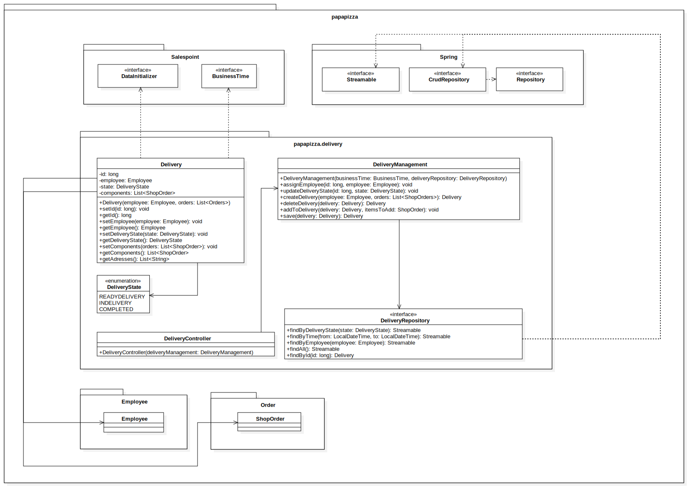

= Developer Documentation
:project_name: Papa Pizza-Service
:sectnums:
:toc:
== __{Papa Pizza-Service}__

[options="header"]
[cols="1, 1, 1, 3, 2"]
|===
|Version | status      | last changed   | authors |  notes
|0.2     | work in progress  | 08.11.2021          | Tom-Erik Günther (Scrum Master), Carl Bennet Kuhlmann, Christian Ziessler, Eric-Ramon Kreyer, Florian Dolzmann, Maximilian Stäps       | group swt21w19
|===

== Introduction and Goals
=== Task Definition

Our main client, the pizza service "Papa Pizza", delivers pizzas, salads and drinks to its customers.
Generally, the software is designed to assist the main tasks and services, that occur in the pizzeria.
It can only to be operated by the members of the "Papa Pizza" service personal, who have to log into the application.
The ordering process works as following:
A "Papa Pizza"-employee (cashier) can take orders from customers over the phone.
Due to security reasons the customer has to pass through his 6-digit TAN.
Therefore, first time customers have to sign up for a customer account in person, which can later be edited or deleted.
When signing up, they will receive their first invoice with a TAN.
Using this TAN customers can now place their next order by phone.
After ordering the TAN will be invalidated and the customer needs a new one, which they can find on his latest invoice.
With their new TAN the customer is now able to place a new order.
If one loses their TAN, they have to go to the store and request a new TAN.

After verifying the customer with help of their TAN and phone number they can now place their order.
In the Order menu, the employee can create orders with custom pizzas, including several toppings, or choose from a variety of predesigned pizzas for the customer.
In Addition, an order can be delivered with one or more dining sets for a deposit of 15 € each.
If not returned, the rental will be considered as bought after one month of lending.
A customer placing an order above 30 € will also receive a free drink.
Moreover, the customer can decide to pick up his food instead of getting it delivered and receive a 10% discount.
After confirming the order, every customer gets an estimated delivery time for his order, which shouldn't be more than 45 minutes.

Next, ordered pizzas will be placed in an automatically assigned oven (by an assigned chef).
Every pizza is being baked in the oven for exactly 5 minutes.

If the customer decides to get his order delivered to their address, the software will automatically assign driver(s), vehicle(s) and the concreate delivery(s) to their order.
One driver is able to deliver up to five different orders using one vehicle, which has a limited amount of slots (for order consisting items like e.g. pizzas, drinks, salads etc ).
This means, that an Order could be delivered by multiple drivers.
Every driver needs a sum of 15 minutes for delivering to exactly one address.
This time consists of 7:30 min. driving to the customer and 7:30 min. driving back.
If the driver delivers food to multiple customers at once the time is calculated, so that the driver has one large way back to the pizza place.
This means, that the driver needs exactly 7:30 minutes from one customer to another.
The delivery closes off the ordering process.

The boss also serves as an admin in the software
They can basically see every action, that is done by any employee.
They can assign which employee shall work in which part of the restaurant.
The boss is also able to hire/fire new employees or buy/sell ovens or vehicles when needed.
The number of pizza bakers, ovens and vehicles in use is determined by the boss, who makes this decision guided by the system (Analytics) once every quarter.
To help their decision they can see different graphs and past orders.
The boss is also able to see everything that is in the inventory, which consists of vehicles and ovens, pizza presets, salads, drinks, toppings and dish sets.
They can list/delist new items, add/delete pizza presets and so on.

Our software has to aid all those tasks while remaining clear and easy to use.

=== Quality Demands

Priority from 1 to 5

[options="header", cols="1h, ^1h , 3"]
|===
|Quality Demand           | Priority | Explanation
|Maintainability          | 3 | The ease with which the software can be modified to correct faults, improve performance or other attributes.
|Security                 | 4 | The principle that every user has only certain access to the software and therefore can only interact with the system in an intended and authorized way.
|Visual Appeal            | 2 | The aim to provide an appealing user inteface.
|Expressive user interface| 4 | The aim to pronounce important features of the software and to keep the user inteface clean.
|Robust Usability         | 4 | The ability of the software to cope with errors during execution, as well as to respond to every possible entry with an well defined response.
|Fast Usability           | 5 | The principle that more often used features are especially easy to access, as well as to provide fast navigations within the software.
|===

== Constraints 
=== Hardware Specifications

A list of devices or hardware for using the software

* Server
* Cash register terminal
* Computer
* Keyboard
* Mouse

The system is going to be used in a store with real application area.

The software is supposed to run on a server, that is not connected to the internet. The software will be executed on a completly local system.

=== Software Specifications

The interfaces can be reached via the web browser.

This Java version is required:

* Java 11

The system shall be accessible and visually optimized for the following browsers:

    Mozilla Firefox, version 93.0+

    Google Chrome, version 95.0.4638.54+

=== Product Usage

The primary users of the software are staff members of the "Papa Pizza" restaurant. This means, that the customers will not be able to use the system and every interaction is made by either Employees or the Boss.

The system shall not need technical maintenance, as the staff isn't trained for technical support.
The Software is designed in a way that allows the boss to identify as an admin.
All data would be stored in a database and can be selected via the application (e.g. no SQL knowledge should be required for a boss).

== Context and Scope
=== Context Diagram

[[context_diagram]]

== Solution Strategy
=== Quality Demand Fulfillment

[options="header", cols="2h, 7"]
|===
|Quality Demand
|Solution approach

|Maintainability
a|
* *Modularity* The application is made up of individual components, so changes to one component have less impact on other components.
* *Modifiabilty* The software must be expandable. Changes / Extensions should not affect the software and should not lead to errors.
* *Reusability* Make sure that components of the system can be reused by other components from the system.

|Usability
a|
* *User interface aesthetics* The user interface must be functional. The user interface should therefore be simple and easy to use. It doesn't necessarily have to be aesthetically pleasing.
* *Accessibility* Ensuring that people can use the system with a variety of functions. This can be achieved by using suitable font sizes and color contrasts.
* *User error protection / Error handling* The user should be warned by invalid entries.
* *Learnability* Make the system can be easily used and understood by the users. This can be achieved with a navigation bar and appropriate labels.

|Security
a|
* *Accountability* Actions must be clearly traceable to entitys or persons. For this, every `Order` should be linked to a `Customer`.
* *Integrity* The software prevents unauthorized changes to data. This is realized by _Spring Security_ (`@ PreAuthorize` - annotation). 
* *Confidentiality* The software has an access restriction to prevent unauthorized use. `Boss` is the only actor who has access to everything. The others ('Employee') have their own task area. The employees cannot access one another's areas of responsibility.
* *TAN usability* Ensure that the TAN cannot be used more than once. In addition, the system is not allowed to issue a TAN more than once. 

|Hardware usability
a|
* *Compatibility* The software should be capable of running on cash register terminals.

|===

=== Software Architecture

[[]]

Top Level Architecture of the application

[[]]

Client Server Model

HTML-Templates are rendered clientside with their corresponding CSS-Stylesheets. The data shown in the templates is provided by Thymeleaf. Thymeleaf receives the requested data by the controller classes, which are implemented in the backend. These controller classes on the other hand use instances and methods of the model classes. By default, an underlying H2 database saves data persistently.

=== Architecture Decisions

==== Design Patterns
* Spring MVC

==== Persistence
The application uses Hibernate annotation based mapping to assign Java classes to database tables. The used database is H2.
Persistence is deactivated, because it is default. When you activate persistence storage, then the following two lines in the file _application.properties_ have to be uncommented:
....
# spring.datasource.url=jdbc:h2:./db/papapizza
# spring.jpa.hibernate.ddl-auto=update
....

==== User Interface
[[TLA]]

=== Use of external Frameworks

[options="header", cols="1,2"]
|===
|External Package |Used by
|salespointframework.useraccount |
employee.Employee +
employee.EmployeeManagement +
order.ShopOrderRepository +
order.ShopOrderManagement
|salespointframework.catalog |
inventory.ShopCatalog +
inventory.ShopCatalogInitializer +
inventory.ShopCatalogManagement +
inventory.ShopInventoryController +
inventory.items.ConsumableProduct +
inventory.items.DishsetProduct +
inventory.items.OvenProduct +
inventory.items.PizzaProduct +
inventory.items.ToppingProduct +
inventory.items.VehicleProduct +
inventory.creationForms.ConsumableProductCreationForm +
inventory.creationForms.DishsetProductCreationForm +
inventory.creationForms.OvenProductCreationForm +
inventory.creationForms.PizzaProductCreationForm +
inventory.creationForms.ToppingProductCreationForm +
inventory.creationForms.VehicleProductCreationForm
|salespointframework.time |
kitchen.Kitchen +
order.ShopOrderManagement
|salespointframework.core |
customer.CustomerDataInitializer +
employee.EmployeeDataInitializer +
inventory.ShopCatalogInitializer 
|salespointframework.order |order.ShopOrder
|springframework.data.repository |
customer.CustomerRepository +
employee.EmployeeRepository +
order.ShopOrderRepository
|matplot4j |analytics.Analytics
|salespointframework.SalesPointSecurityConfiguration |papapizza.WebSecurityConfiguration
|springframework.HttpSecurity |papapizza.WebSecurityConfiguration
|springframework.WebMvcConfigurer |papapizza.PapasPizzaServiceWebConfiguration
|springframework.ViewControllerRegistry |papapizza.PapasPizzaServiceWebConfiguration
|springframework.SpringApplication |papapizza.Application
|springframework.data |
inventory.ShopCatalogManagement +
inventory.ShopCatalog
|springframework.beans |
inventory.ShopCatalogInitializer +
inventory.ShopCatalogController
|springframework.stereotype |
inventory.ShopCatalogManagement +
inventory.ShopCatalogInitializer
|springframework.transaction |inventory.ShopCatalogManagement
|springframework.security |inventory.ShopCatalogController
|springframework.validation |inventory.ShopCatalogController
|springframework.web |inventory.ShopCatalogController
|springframework.ui |
employee.EmployeeController +
inventory.ShopCatalogController
|javamoney.moneta |
inventory.ShopCatalogManagement +
inventory.creationForms.ConsumableProductCreationForm +
inventory.creationForms.DishsetProductCreationForm +
inventory.creationForms.OvenProductCreationForm +
inventory.creationForms.PizzaProductCreationForm +
inventory.creationForms.ToppingProductCreationForm +
inventory.creationForms.VehicleProductCreationForm
|===

== Building block view

=== Application

[options="header"]
|===
|Class |Description
|Application|The central application class to configure the Spring container and run the application
|PapasPizzaServiceWebConfiguration|Configuration class to route /login directly to the login.html template
|WebSecurityConfiguration|Configuration class to set up basic security and login/logout options
|===

=== Order

[options="header"]
|===
|Class |Description
|ShopOrderRepository
|A repository interface to manage ShopOrder-instances.

|ShopOrderManagement
|A service-class to provide methods to operate on the ShopOrderRepository.

|ShopOrder
|An entity class representing an entire order in the system, including the associated Employees, Customers, etc.

|ShopOrderState
|An enumeration extending the Salespoint provided states.

|ShopOrderController
|A Spring MVC Controller to handle the overview of all currently not closed ShopOrders.

|NewShopOrderController
|A Spring MVC Controller to handle the creation of new orders and verification of Customers.
|===

=== Kitchen

[options="header"]
|===
|Class |Description
|Kitchen|Nothing
|KitchenManagement|This class handles the processes between Spring and Kitchen class
|KitchenController|This class handles the communication to the HTML page
|DisplayableKitchen|This class handles the output to the HTML-Page
|===

=== Delivery

[options="header"]
|===
|Class |Description
|Delivery| Defines the Delivery class, to be used by all other classes in the package
|DeliveryController |A Spring MVC Controller to handle requests and show Deliveries; handles communication to the HTML page
|DeliveryManagement |A Management class to handle most of the operations regarding the common processes required during a deliveries lifecycle
|DeliveryRepository |A repository to store deliveries and manage search/find requests; connection to the database
|DeliveryState |Simple Enum for the different states a delivery goes through
|DeliveryDataInitializer |An implementation of the Salespoint DataInitializer to create dummy data for test purposes
|===

=== Customer

image:models/design/BuildingBlockDiagramms/BBD Customer.svg[]

[options="header"]
|===
|Class |Description
|Customer | Class (Entity) that represents a customer
|CustomerController | Spring MVC controller which handles requests to list, edit, filter, sort and add customers
|CustomerDataInitializer | Implementation of the salespoint DataInitializer to create customer dummy data on startup
|CustomerManagement | service to manage customers, junction between database and other program components
|CustomerRepository | repository interface for JPA to edit, save and load customers
|CustomerCreationForm | class to validate form inputs
|===

=== Employee

[options="header"]
|===
|Class |Description
|Employee |Custom class to extend Salespoint-UserAccount
|EmployeeController |A Spring MVC Controller to handle requests to add and show employees
|EmployeeCreationForm |An interface to validate the user input of the registration formular
|EmployeeDataInitializer |An implementation of the DataInitializer to create dummy employees on application startup
|EmployeeManagement |Service class to manage employees
|EmployeeRepository |A repository interface to manage Employee-instances
|===

=== Inventory

[options="header"]
|===
|Class |Description
|ShopCatalog |A repository, that stores all the products that are initialized.
|ShopCatalogInitializer |Initializes the pre-created Products at runtime.
|ShopCatalogManagement |Manages everything around the ShopCatalog e.g. creating new products and storing them, finding products, editing or deleting products etc.
|ShopInventoryController |Spring MVC Controller to handle the front-end requests to display the page or show the forms to add, edit and delete inventory products.
|ConsumableProduct |Salespoint Product, that contains name, price and also ingredients.
|DishSetProduct |Salespoint Product, that contains a name and a deposit price.
|VehicleProduct |Salespoint Product, that contains name, price and the number of slots (number of products, that can be stored in one vehicle).
|OvenProduct |Salespoint Product, that contains a price.
|PizzaProduct |Salespoint Product, that contains name, price and a toppings (ToppingProduct).
|ToppingProduct |Salespoint Product, that contains name and price.
|VehicleProductCreationForm |A creation form to add and edit VehicleProducts via ShopCatalogManagement.
|DishSetProductCreationForm |A creation form to add and edit DishsetProducts via ShopCatalogManagement.
|ConsumableProductProductCreationForm |A creation form to add and edit ConsumableProducts via ShopCatalogManagement.
|OvenProductProductCreationForm |A creation form to add and edit OvenProducts via ShopCatalogManagement.
|ToppingProductProductCreationForm |A creation form to add and edit ToppingProducts via ShopCatalogManagement.
|PizzaProductProductCreationForm |A creation form to add and edit PizzaProducts via ShopCatalogManagement.
|===

=== Analytics

[options="header"]
|=== 
|Class |Description

|AnalyticsController
|Spring MVC Controller to handle the front-end requests to display various data in form of tables and diagrams.

|Analytics
|A Service-class, to generate and provide data and tables for the controller class.

|===

=== Traceability between Analysis- and Design Model

[options="header"]
|===
|Class/Enum (Analysis)|Class/Enum (Design) |Usage
|Inventory
|Salespoint.UniqueInventory +
Salespoint.Catalog
|

|InventoryItem
|Salespoint.UniqueInventoryItem +
Salespoint.Product
|

|PapasPizzaService
|papapizza.Application
|

|CustomerManagement
|papapizza.customer.CustomerManagement +
papapizza.customer.CustomerRepository
|

|Customer
|papapizza.customer.Customer
|

|Tan
|papapizza.Customer.Tan +
papapizza.Customer.TanRepo
|

|Order
|papapizza.order.ShopOrderManagement +
Salespoint.OrderManagement +
papapizza.order.ShopOrder +
Salespoint.Order
|

|OrderState
|papapizza.order.ShopOrderState
|

|OrderRepository
|papapizza.order.ShopOrderRepostitory +
Salespoint.OrderRepository
|

|KitchenService
|papapizza.kitchen.KitchenManagement
|

|EmployeeManagement
|papapizza.employee.EmployeeManagement +
Salespoint.UserAccountManagement +
papapizza.EmployeeRepository +
Salespoint.UserAccountRepository
|

|User
|papapizza.employee.Employee +
Salespoint.UserAccount
|

|Role
|Salespoint.Role
|

|DeliveryService
|papapizza.DeliveryManagement
|

|Delivery
|papapizza.ShopOrder
|

|DeliveryState
|papapizza.ShopOrderState
|

|PizzaState
|papapizza.inventory.products.PizzaState
|
|===

== Runtime view
=== Order

== Technical Debt
* intentionally left blank for the time being

