= Specification book
:project_name: Papa Pizza-Service
:sectnums:
:toc:
== __{Papa Pizza-Service}__

[options="header"]
[cols="1, 1, 1, 3, 2"]
|===
|Version | status      | last changed   | authors |  notes
|0.2     | work in progress  | 31.10.2021          | Tom-Erik Günther (Scrum Master), Carl Bennet Kuhlmann, Christian Ziessler, Eric-Ramon Kreyer, Florian Dolzmann, Maximilian Stäps       | group swt21w19
|===

== Summary

This document represents the specification book (SB, German: a "Pflichtenheft") of the project __{project_name}__ from the group swt21w19.
It provides an overview of the software product to be built and functions as a basis for communication between
the client and the development team.
This documents main purpose is to provide a foundation for a contract between the
client and the contractor, and should therefore be validated and checked for consistency.
Moreover, as requirements and circumstances constantly evolve during a project, adjustments are to be expected and have to be documented.
The SB describes what the desired system has to fulfill and partially how the contractor intends to implement the solution.
We aim to use this SB as a guideline over the course of the "Softwaretechnologie-Projekt" at Technische Universität Dresden (TU Dresden). 

== Task Definition and Goals

//@everyone
//@everyone

Our main client, the pizza service "Papa Pizza", delivers pizzas, salads and drinks to its customers.
Generally, the software is designed to assist the main tasks and services, that occur in the pizzeria.
It can only to be operated by the members of the "Papa Pizza" service personal, who have to log into the application.
The ordering process works as following:
A "Papa Pizza"-employee (cashier) can take orders from customers over the phone.
Due to security reasons the customer has to pass through his 6-digit TAN.
Therefore, first time customers have to sign up for a customer account in person, which can later be edited or deleted.
When signing up, they will receive their first invoice with a TAN.
Using this TAN customers can now place their next order by phone. 
After ordering the TAN will be invalidated and the customer needs a new one, which they can find on his latest invoice.
With their new TAN the customer is now able to place a new order.
If one loses their TAN, they have to go to the store and request a new TAN.

After verifying the customer with help of their TAN and phone number they can now place their order.
In the Order menu, the employee can create orders with custom pizzas, including several toppings, or choose from a variety of predesigned pizzas for the customer.
In Addition, an order can be delivered with one or more dining sets for a deposit of 15 € each.
If not returned, the rental will be considered as bought after one month of lending.
A customer placing an order above 30 € will also receive a free drink.
Moreover, the customer can decide to pick up his food instead of getting it delivered and receive a 10% discount.   
After confirming the order, every customer gets an estimated delivery time for his order, which shouldn't be more than 45 minutes.

Next, ordered pizzas will be placed in an automatically assigned oven (by an assigned chef).
Every pizza is being baked in the oven for exactly 5 minutes.

If the customer decides to get his order delivered to their address, the software will automatically assign driver(s), vehicle(s) and the concreate delivery(s) to their order.
One driver is able to deliver up to five different orders using one vehicle, which has a limited amount of slots (for order consisting items like e.g. pizzas, drinks, salads etc ).
This means, that an Order could be delivered by multiple drivers.
Every driver needs a sum of 15 minutes for delivering to exactly one address. 
This time consists of 7:30 min. driving to the customer and 7:30 min. driving back.
If the driver delivers food to multiple customers at once the time is calculated, so that the driver has one large way back to the pizza place.
This means, that the driver needs exactly 7:30 minutes from one customer to another.
The delivery closes off the ordering process.

The boss also serves as an admin in the software
They can basically see every action, that is done by any employee.
They can assign which employee shall work in which part of the restaurant. 
The boss is also able to hire/fire new employees or buy/sell ovens or vehicles when needed.
The number of pizza bakers, ovens and vehicles in use is determined by the boss, who makes this decision guided by the system (Analytics) once every quarter.
To help their decision they can see different graphs and past orders.
The boss is also able to see everything that is in the inventory, which consists of vehicles and ovens, pizza presets, salads, drinks, toppings and dish sets.
They can list/delist new items, add/delete pizza presets and so on.

Our software has to aid all those tasks while remaining clear and easy to use.

== Product Usage

The system is going to be used in a store with real application area.

The software is supposed to run on a server, that is not connected to the internet. The software will be executed on a completly local system.
The interfaces can be reached via the web browser.

The system shall be accessible and visually optimized for the following browsers:

    Mozilla Firefox, version 93.0+

    Google Chrome, version 95.0.4638.54+

The primary users of the software are staff members of the "Papa Pizza" restaurant. This means, that the customers will not be able to use the system and every interaction is made by either Employees or the Boss.

The system shall not need technical maintenance, as the staff isn't trained for technical support.
The Software is designed in a way that allows the boss to identify as an admin.
Any data shall be stored persistently in a database and be accessible through the application (e.g. no SQL knowledge should be required for a boss).

[[Stakeholders]]
== Stakeholders

In the table below, the stakeholders are listed, a priority is assigned (in case requirements should clash this allows for easier decisions)
and their high-level goals are described.

The assigned priorities range from 1 (lowest priority) to 5 (highest priority).

[options="header", cols="2, ^1, 4, 4"]
|===
|Name
|Priority (1..5)
|Description
|Goals

| Boss
|5
|The owner of the company ("Papa Pizza") and primary client of this project.
a|
- Automate processes
- Manage employees of pizzashop
- Manage the inventory of the pizzashop
- Possibility to look up all the data in the system

|Employee
|4
|Primary user of the application, supposed to generate income
a|
- Good user experience
- Clear and easy to use
- Fast order processing

|===

== System Boundaries and Component Structure

=== System Context Diagram

The system context diagram shows the planned system in its environment.

[[context_diagram]]
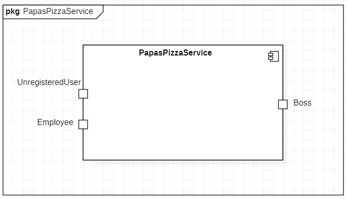

=== Top-level Architecture

Top-Level view of the system.

[[TLA]]
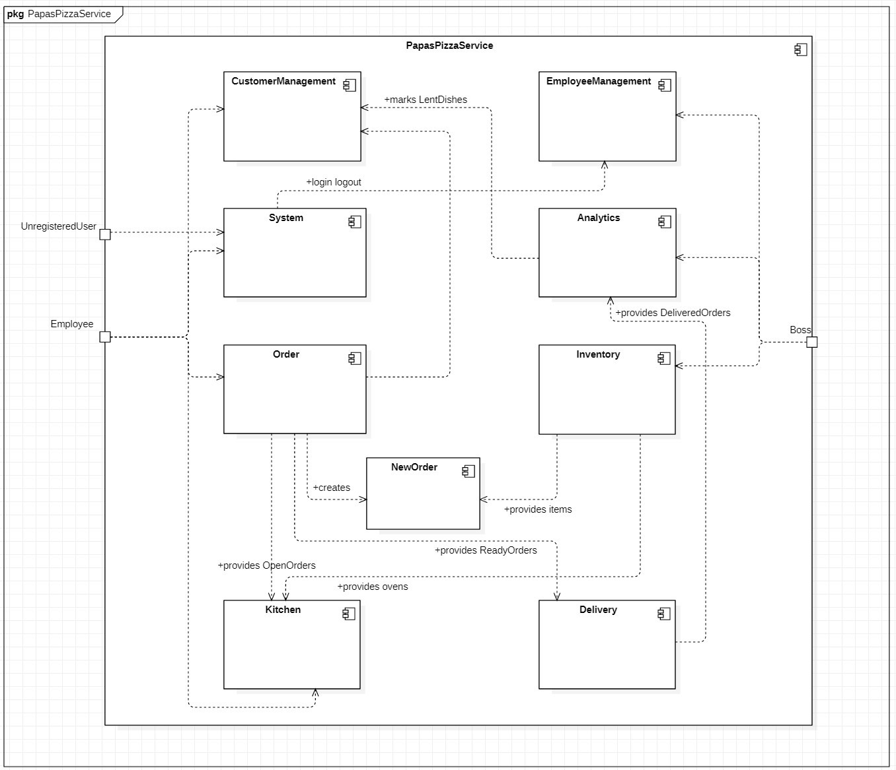

== Use Cases

=== Actors

Actors are users of the system. The following table describes each actor in detail.

// See http://asciidoctor.org/docs/user-manual/#tables
[options="header"]
[cols="1,4"]
|===
|Name |Description
|Boss  | The ``BOSS`` has administrative privileges on the system. They can add new ``Employees`` and set their roles.
|Employee | Employees are the default users of our system. An employee can have one of the three different roles: ``ORDER`` - ``KITCHEN`` - ``DELIVERY``.
            Each role has a specific function in our system with separate permissions. +
- the ``ORDER`` role belongs to the cashier +
- the ``KITCHEN`` role belongs to the chef +
- the ``DELIVERY`` role belongs to the driver

|===

=== Use-Case Diagram

[[use_case_diagram]]
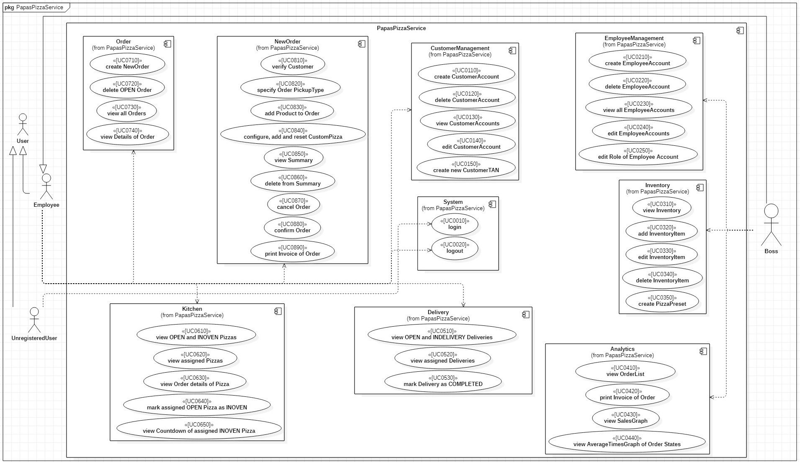
=== Use Case Descriptions
//include::./use_case_tables.adoc[]
//COPY FILE CONTENT BELOW, DONT USE INCLUDE

==== System
[cols="1h, 3"]
[[UC0010]]
|===
|ID                         |**<<UC0010>>**
|Name                       |login
|Description               |The employee can log into the system to use further functionalities of the system.
|Actors                    |employee
|Trigger                   a|gui (login-context -> button)
|Requirements           a|The employee is not currently logged in. The system context is in the login view.
|Essential Steps     a|
1. The employee enters his login details.
2. The employee presses the "login" button in the form.
3. The employee enters his (role-dependent) system context if the login details where verified. The employee gets a warning if the login details where falsified.
|Extensions              |
|Functional Requirements     | <<F0010>>
|===

[cols="1h, 3"]
[[UC0020]]
|===
|ID                         |**<<UC0020>>**
|Name                       |logout
|Description               |The employee can log out from the system.
|Actors                    |employee
|Trigger                   a|gui (nav-bar -> button)
|Requirements           a|The employee is already logged in.
|Essential Steps     a|
1. The employee presses the "logout" button in the gui.
2. The employee gets logged out and the system context changes to the login form.
|Extensions              |
|Functional Requirements     | <<F0010>>
|===

==== Customer Management
[cols="1h, 3"]
[[UC0110]]
|===
|ID                         |**<<UC0110>>**
|Name                       |create CustomerAccount
|Description               |The employee can register new customers into the system by creating a new CustomerAccount.
|Actors                     |employee
|Trigger                    |gui (customer-management-context -> button)

|Requirements           a|The employee has the role "CASHIER" or "BOSS". The customer isn't already registered.

|Essential Steps     a|
1. The employee opens the customer-registration-form.
2. The employee enters the required information.
3. The employee finishes by pressing the "create new Account" button. The system will save the new CustomerAccount, if they aren't already registered.
|Extensions              |
|Functional Requirements     | <<F0110>>, <<F0111>>
|===

[cols="1h, 3"]
[[UC0120]]
|===
|ID                         |**<<UC0120>>**
|Name                       |delete CustomerAccount
|Description               |The employee can delete a CustomerAccount if explicitly wanted.
|Actors                     |employee
|Trigger                    |gui (customer-management-context -> find CustomerAccount (search/scroll through customer-accounts-table) -> table entry -> button)

|Requirements           a|The employee has the role "CASHIER" or "BOSS". The customer is already registered.

|Essential Steps     a|
1. The employee navigates to the desired CustomerAccount to delete.
2. The employee presses the "Del" button.
3. The employee has to confirm his action inside a popup window which consequentially shows up.
4. The CustomerAccount is deleted.

|Extensions              |
|Functional Requirements     | <<F0120>>, <<F0721>>
|===

[cols="1h, 3"]
[[UC0130]]
|===
|ID                         |**<<UC0130>>**
|Name                       |view CustomerAccounts
|Description               |The employee can see a list of all Customer Accounts.
|Actors                     |employee
|Trigger                    |gui (customer-management-context -> CustomerAccount-table-view)

|Requirements           a|The employee must be logged in.

|Essential Steps     a|
1. The employee can scroll to navigate through the table entries.

|Extensions              |
|Functional Requirements     | <<F0130>>, <<F0131>>
|===

[cols="1h, 3"]
[[UC0140]]
|===
|ID                         |**<<UC0140>>**
|Name                       |edit CustomerAccount
|Description               |The employee can edit the Account-information of a customer if needed.
|Actors                     |employee
|Trigger                    |gui (customer-management-context -> find CustomerAccount (search/scroll through customer-accounts-table) -> table entry -> button)

|Requirements           a|The employee has the role "CASHIER" or "BOSS". The customer is already registered.

|Essential Steps     a|
1. The employee navigates to the desired CustomerAccount to alter.
2. The employee presses the "edit" button.
3. The employee updates the CustomerAccount-information and presses the "finish" button.
4. The system will save the updated CustomerAccount-information.

|Extensions              |
|Functional Requirements     | <<F0140>>, <<F0721>>
|===

[[sequence_diagram_edit_customer_account]]
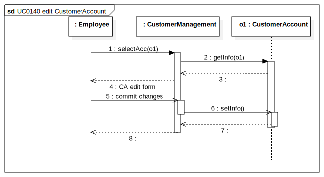

[cols="1h, 3"]
[[UC0150]]
|===
|ID                         |**<<UC0150>>**
|Name                       |create new CustomerTAN
|Description               |The employee can assign a new TAN to a CustomerAccount
|Actors                     |employee
|Trigger                    |gui (customer-management-context -> find CustomerAccount (search/scroll through customer-accounts-table) -> table entry -> button)

|Requirements           |The employee has the role "CASHIER" or "BOSS". The customer is already registered.

|Essential Steps     a|
1. The employee navigates to the desired CustomerAccount to assign a new TAN to.
2. The employee presses the "change" button within the "current TAN"-column.
3. The employee has to confirm his action inside a popup window which consequentially shows up.
4. The system will create a new unique TAN and assigns it to the CustomerAccount.

|Extensions              |
|Functional Requirements     | <<F0150>>, <<F0721>>
|===

==== Employee Management
[cols="1h, 3"]
[[UC0210]]
|===
|ID                         |**<<UC0210>>**
|Name                       |create EmployeeAccount
|Description               |The boss can create a new system-wide employee account.
|Actors                     |boss
|Trigger                    |gui (employee-management-context -> button)
|Requirements           a|The employee  has the role "BOSS".
|Essential Steps     a|
1. The boss presses the "add employee account" button.
2. The boss enters the employees credentials and role inside a newly opened window.
3. The boss presses the "confirm" button.
4. The system creates a new employee account with the given details and role.
|Extensions              |
|Functional Requirements     | <<F0200>>, <<F0211>>
|===

[cols="1h, 3"]
[[UC0220]]
|===
|ID                         |**<<UC0220>>**
|Name                       |delete EmployeeAccount
|Description               |The boss can delete an employee account.
|Actors                     |boss
|Trigger                    |gui (employee-management-context -> employee-account-table-view -> table-entry -> button)
|Requirements           a|The employee  has the role "BOSS".
|Essential Steps     a|
1. The boss navigates to the desired employee account to delete.
2. The boss presses the "Del" button.
3. The boss has to confirm his action inside a popup window which consequentially shows up.
4. The employee account is deleted.
|Extensions              |
|Functional Requirements     | <<F0220>>, <<F0721>>
|===

[cols="1h, 3"]
[[UC0230]]
|===
|ID                         |**<<UC0230>>**
|Name                       |view all EmployeeAccounts
|Description               |The boss can see a list of all employee accounts.
|Actors                     |boss
|Trigger                    |gui (employee-management-context -> employee-account-table-view)
|Requirements           a|The employee  has the role "BOSS".
|Essential Steps     a|
1. The employee can scroll to navigate through the table entries.
|Extensions              |
|Functional Requirements     | <<F0230>>
|===

[cols="1h, 3"]
[[UC0240]]
|===
|ID                         |**<<UC0240>>**
|Name                       |edit EmployeeAccount
|Description               |The boss can edit the account details of an employee.
|                     |boss
|Trigger                    |gui (employee-management-context -> find employee account (search/scroll through employee-account-table) -> table entry -> button)
|Requirements           a|The employee  has the role "BOSS".
|Essential Steps     a|
1. The boss navigates to the desired employee account to alter.
2. The boss presses the "edit" button.
3. The boss updates the employee account details and presses the "finish" button.
4. The boss has to confirm his action inside a popup window which consequentially shows up.
5. The system will save the employee account details.
|Extensions              |
|Functional Requirements     | <<F0240>>, <<F0721>>
|===

[cols="1h, 3"]
[[UC0250]]
|===
|ID                         |**<<UC0250>>**
|Name                       |edit Role of Employee Account
|Description               |The boss can edit the role of an employee.
|Actors                     |boss
|Trigger                    |gui (employee-management-context -> find employee account (search/scroll through employee-account-table) -> table entry -> dropdown)
|Requirements           a|The employee  has the role "BOSS".
|Essential Steps     a|
1. The boss navigates to the desired employee account to alter.
2. The boss selects the desired role inside a dropdown window.
3. The system will save the selected role of the employee.
|Extensions              |
|Functional Requirements     | <<F0250>>
|===

==== Inventory

[cols="1h, 3"]
[[UC0310]]
|===
|ID                         |**<<UC0310>>**
|Name                       |view Inventory
|Description               |The boss can see all items of the inventory inside a sorted and searchable table.
|Actors                     |boss
|Trigger                    |gui (inventory-context -> inventory-table-view)
|Requirements           a|The employee  has the role "BOSS".
|Essential Steps     a|
1. The employee can scroll to navigate through the table entries.
|Extensions              |
|Functional Requirements     | <<F0310>>, <<F0311>>
|===

[cols="1h, 3"]
[[UC0320]]
|===
|ID                         |**<<UC0320>>**
|Name                       |add InventoryItem
|Description               |The boss can add a new inventory item.
|Actors                     |boss
|Trigger                    |gui (inventory-context -> inventory-table-view -> table-section -> button)
|Requirements           a|The employee  has the role "BOSS".
|Essential Steps     a|
1. The boss navigates to the desired section where a new item should be added.
2. The boss presses the "add" button.
3. The boss enters the item details inside a popup window.
4. The boss presses the "confirm" button.
5. The system creates and saves the item in the inventory.
|Extensions              |
|Functional Requirements     | <<F0320>>, <<F0321>>
|===

[cols="1h, 3"]
[[UC0330]]
|===
|ID                         |**<<UC0330>>**
|Name                       |edit InventoryItem
|Description               |The boss can edit the details if an inventory item.
|Actors                     |boss
|Trigger                    |gui (inventory-context -> inventory-table-view -> table-section -> table-entry -> button)
|Requirements           a|The employee  has the role "BOSS".
|Essential Steps     a|
1. The boss navigates to the desired section and item that should be edited.
2. The boss presses the "edit" button.
3. The boss edits the item details inside a newly opened window.
4. The boss presses the "confirm" button.
5. The boss has to confirm his action inside a popup window which consequentially shows up.
6. The system saves the item details.
|Extensions              |
|Functional Requirements     | <<F0330>>, <<F0321>>, <<F0721>>
|===

[cols="1h, 3"]
[[UC0340]]
|===
|ID                         |**<<UC0340>>**
|Name                       |delete InventoryItem
|Description               |The boss can delete an inventory item.
|Actors                     |boss
|Trigger                    |gui (inventory-context -> inventory-table-view -> table-section -> table-entry -> button)
|Requirements           a|The employee  has the role "BOSS".
|Essential Steps     a|
1. The boss navigates to the desired section and item that should be deleted.
2. The boss presses the "del" button.
3. The boss has to confirm his action inside a popup window which consequentially shows up.
4. The system deletes the item in the inventory
|Extensions              |
|Functional Requirements     | <<F0340>>, <<F0721>>
|===

[cols="1h, 3"]
[[UC0350]]
|===
|ID                         |**<<UC0350>>**
|Name                       |create PizzaPreset
|Description               |The boss can configure a new pizza preset.
|Actors                     |boss
|Trigger                    |gui (inventory-context -> inventory-table-view -> pizza-preset-table-section -> button)
|Requirements           a|The employee has the role "BOSS".
|Essential Steps     a|
1. The boss navigates to the pizza preset section.
2. The boss presses the "add" button.
3. The boss enters the name and configures the new pizza preset inside a newly opened window.
4. The boss presses the "confirm" button.
5. The system creates and saves the pizza preset in the inventory.
|Extensions              |
|Functional Requirements     | <<F0350>>
|===

[[sequence_diagram_create_pizza_preset]]
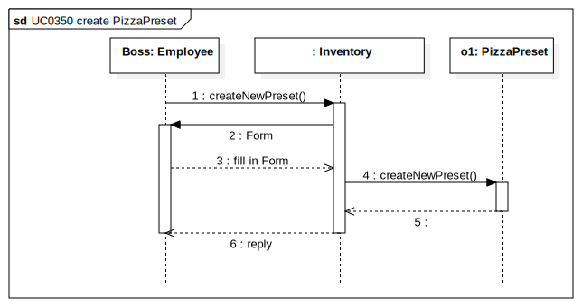

==== Analytics

[cols="1h, 3"]
[[UC0410]]
|===
|ID                         |**<<UC0410>>**
|Name                       |view OrderList
|Description               |The boss can see a searchable list of all orders with the state "COMPLETED"
|Actors                     |boss
|Trigger                    |gui (analytics-context -> completed-orders-table-view)
|Requirements           a|The employee  has the role "BOSS".
|Essential Steps     a|
1. The boss can scroll or search to navigate through the table entries.
|Extensions              |
|Functional Requirements     | <<F0410>>
|===

[cols="1h, 3"]
[[UC0420]]
|===
|ID                         |**<<UC0420>>**
|Name                       |print Invoice of Order
|Description               |The boss can print the invoice of a completed order as a PDF file.
|Actors                     |Boss
|Trigger                    |gui (analytics-context -> completed-orders-table-view -> table-entry -> button)
|Requirements           a|The employee  has the role "BOSS".
|Essential Steps     a|
1. The boss navigates to the desired order.
2. The boss presses the "print invoice" button.
3. The invoice gets created and saved as a PDF file.
|Extensions              |
|Functional Requirements     | <<F0420>>
|===

[cols="1h, 3"]
[[UC0430]]
|===
|ID                         |**<<UC0430>>**
|Name                       |view SalesGraph
|Description               |The boss can see a graph of sales as a function of time.
|Actors                     |boss
|Trigger                    |gui (analytics-context -> sales-graph)
|Requirements           a|The employee  has the role "BOSS".
|Essential Steps     a|
1. The boss can enter different time spans inside a dropdown menu.
|Extensions              |
|Functional Requirements     | <<F0430>>, <<F0431>>
|===

[[sequence_diagram_view_SalesGraph]]
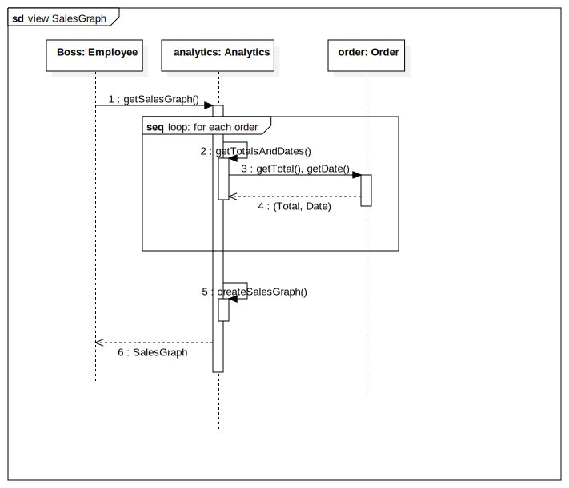

[cols="1h, 3"]
[[UC0440]]
|===
|ID                         |**<<UC0440>>**
|Name                       |view AverageTimesGraph of Order States
|Description               |The boss can see a graph of average times as a function of time.
|Actors                     |boss
|Trigger                    |gui (analytics-context -> average-times-graph)
|Requirements           a|The employee  has the role "BOSS".
|Essential Steps     a|
1. The boss can select different states which average time should be displayed inside a dropdown menu.
2. The boss can enter different time spans inside a dropdown menu.
|Extensions              |
|Functional Requirements     | <<F0440>>, <<F0441>>
|===

==== Delivery

[cols="1h, 3"]
[[UC0510]]
|===
|ID                         |**<<UC0510>>**
|Name                       |view OPEN and INDELIVERY Deliveries
|Description               |The employee can see all deliverys which are currently in the state "OPEN" or "INDELIVERY" inside a table view.
|Actors                     |employee
|Trigger                    |gui (delivery-context -> delivery-table-view)
|Requirements           a|
|Essential Steps     a|
1. The employee can scroll to navigate through the table entries.
|Extensions              |
|Functional Requirements     |<<F0510>>
|===

[cols="1h, 3"]
[[UC0520]]
|===
|ID                         |**<<UC0520>>**
|Name                       |view assigned Deliveries
|Description               |The employee can see all deliverys as well as there customer and adress details, etc. which where assigned to him.
|Actors                     |employee
|Trigger                    |gui (kitchen-context -> assigned-delivery-list-view)
|Requirements           a|The employee  has the role "DRIVER" or "BOSS".
|Essential Steps     a|
1. The employee can scroll to navigate through the list entries.
|Extensions              |
|Functional Requirements     |<<F0520>>
|===

[cols="1h, 3"]
[[UC0530]]
|===
|ID                         |**<<UC0530>>**
|Name                       |mark Delivery as COMPLETED
|Description               |The employee can tell the system, that a delivery has been delivered.
|Actors                     |employee
|Trigger                    |gui (kitchen-context -> assigned-delivery-list-view -> list-entry -> button)
|Requirements           a|The employee  has the role "DRIVER" or "BOSS".
|Essential Steps     a|
1. The employee navigates to the desired delivery.
2. The employee presses the "delivered" button.
3. The system sets the state of the delivery to "COMPLETED".
|Extensions              |
|Functional Requirements     |<<F0530>>
|===

==== Kitchen

[cols="1h, 3"]
[[UC0610]]
|===
|ID                         |**<<UC0610>>**
|Name                       |view OPEN and INOVEN Pizzas
|Description               |The Employee can see all Pizzas which are in the state OPEN or INOVEN inside a table view.
|Actors                     |employee
|Trigger                    |gui (kitchen-context -> pizza-table-view)
|Requirements           a|
|Essential Steps     a|
1. The employee can scroll to navigate through the table entries.
|Extensions              |
|Functional Requirements     |<<F0610>>
|===

[[sequence_diagram_view_open_and_inoven_pizza]]
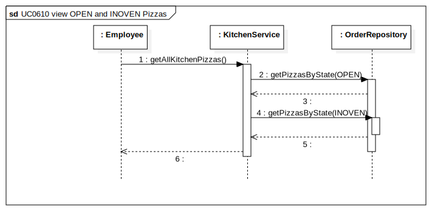

[cols="1h, 3"]
[[UC0620]]
|===
|ID                         |**<<UC0620>>**
|Name                       |view assigned Pizzas
|Description               |The employee can see all pizzas as well as there toppings, etc. which where assigned to him.
|Actors                     |employee
|Trigger                    |gui (kitchen-context -> assigned-pizza-chart-view)
|Requirements           a|The employee  has the role "CHEF" or "BOSS".
|Essential Steps     a|
1. The employee can scroll sideways to navigate through the chart entries.
|Extensions              |
|Functional Requirements     |<<F0620>>
|===

[cols="1h, 3"]
[[UC0630]]
|===
|ID                         |**<<UC0630>>**
|Name                       |view Order details of Pizza
|Description               |The employee can display datails abaout the order of a pizza.
|Actors                     |employee
|Trigger                    |
gui (kitchen-context -> assigned-pizza-chart-view -> button)

gui (kitchen-context -> pizza-table-view -> table-entry -> button)
|Requirements           a|
|Essential Steps     a|
1. The employee navigates to the desired chart or table entry.
2. The employee presses the "order" button.
3. The employee gets displayed a popup window, containing various pieces of information about the order the pizza belongs to.
|Extensions              |
|Functional Requirements     |<<F0740>>
|===

[cols="1h, 3"]
[[UC0640]]
|===
|ID                         |**<<UC0640>>**
|Name                       |mark assigned OPEN Pizza as INOVEN
|Description               |The employee can tell the system, that an assigned pizza has been put into the oven
|Actors                     |employee
|Trigger                    |gui (kitchen-context -> assigned-pizza-chart-view -> button)
|Requirements           a|The employee  has the role "CHEF" or "BOSS". The employee has at least one assigned pizza.
|Essential Steps     a|
1. The employee presses inside the desired pizza chart the "put into oven" button.
2. The system sets the pizza state to "INOVEN" and initiates **<<UC0650>>**
|Extensions              |
|Functional Requirements     |<<F0640>>
|===

[cols="1h, 3"]
[[UC0650]]
|===
|ID                         |**<<UC0650>>**
|Name                       |view Countdown of assigned INOVEN Pizza
|Description               |The employee can see the time an assigned pizza with state "INOVEN" has to remain in the oven.
|Actors                     |employee
|Trigger                    |gui (kitchen-context -> assigned-pizza-chart-view -> countdown-timer)
|Requirements           a|The employee  has the role "CHEF" or "BOSS". The pizza's state is "INOVEN" as set by **<<UC0640>>**
|Essential Steps     a|
1. The employee navigates to the desired pizza chart.
2. The employee can see a countdown of the remaining time the pizza should stay in the oven.
|Extensions              |
|Functional Requirements     |<<F0650>>
|===

==== Order

[cols="1h, 3"]
[[UC0710]]
|===
|ID                         |**<<UC0710>>**
|Name                       |create NewOrder
|Description               |The employee can redirect the system context to the new-order-form, where he can construct a new order.
|Actors                     |employee
|Trigger                    |gui (order-context -> button)
|Requirements           a|The employee  has the role "CASHIER" or "BOSS".
|Essential Steps     a|
1. The employee presses the "new Order" button.
2. The employee gets redirected to the new-order-form.
|Extensions              |
|Functional Requirements     |<<F0710>>
|===

[cols="1h, 3"]
[[UC0720]]
|===
|ID                         |**<<UC0720>>**
|Name                       |delete OPEN Order
|Description               |The employee can delete any order with the state "OPEN".
|Actors                     |employee
|Trigger                    |gui (order-context -> all-orders-table-view -> table-entry -> button)
|Requirements           a|The employee  has the role "CASHIER" or "BOSS".
|Essential Steps     a|
1. The employee navigates to the desired open order.
2. The employee presses the "delete" button.
3. The employee has to confirm his action inside a popup window which consequentially shows up.
4. The order ist deleted. Therefore the system reassigns the chefs and drivers for the other orders
|Extensions              |
|Functional Requirements     |<<F0720>>, <<F0721>>
|===

[[sequence_diagram_delete_open_order]]
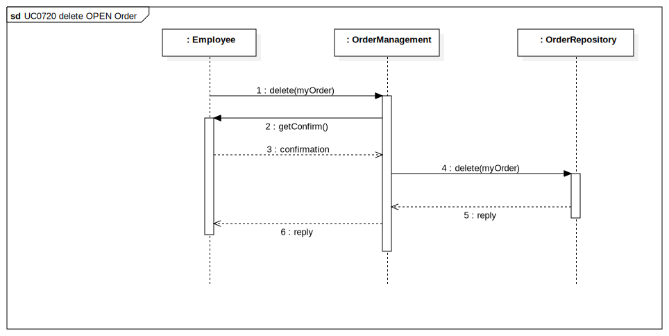

[cols="1h, 3"]
[[UC0730]]
|===
|ID                         |**<<UC0730>>**
|Name                       |view all Orders
|Description               |The employee can see all orders with another state than "COMPLETED" in a table-view.
|Actors                     |employee
|Trigger                    |gui (order-context -> all-orders-table-view)
|Requirements           a|
|Essential Steps     a|
1. The employee can scroll to navigate through the table entries.
|Extensions              |
|Functional Requirements     |<<F0700>>, <<F0730>>
|===
[[sequence_diagram_view_all_orders]]
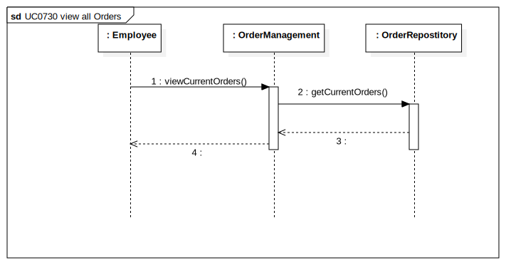

[cols="1h, 3"]
[[UC0740]]
|===
|ID                         |**<<UC0740>>**
|Name                       |view Details of Order
|Description               |The employee can see specific details of an order in the table-view.
|Actors                     |employee
|Trigger                    |gui (order-context -> all-orders-table-view -> table-entry -> button)
|Requirements           a|
|Essential Steps     a|
1. The employee navigates to the desired open order.
2. The employee presses the "details" button.
3. A popup window shows up, displaying further details about the order.
4. The window can be closed by a "close" button.
|Extensions              |
|Functional Requirements     |<<F0740>>
|===

==== NewOrder

[cols="1h, 3"]
[[UC0810]]
|===
|ID                         |**<<UC0810>>**
|Name                       |verify Customer
|Description               |The employee can check that the phone number and the TAN of a customer are valid.
|Actors                     |employee
|Trigger                    |gui (new-order-context -> button)
|Requirements           a|The employee  has the role "CASHIER" or "BOSS". The employee has entered a phone number and a TAN.
|Essential Steps     a|
1. The employee enters a phone number and a TAN in the corresponding input fields.
2. The employee presses the "verify" button.
3. The employee gets a response from the system if the customer account exists and if the TAN matches the customers current TAN.
|Extensions              |
|Functional Requirements     |<<F0810>>
|===

[[sequence_diagram_verify_customer]]
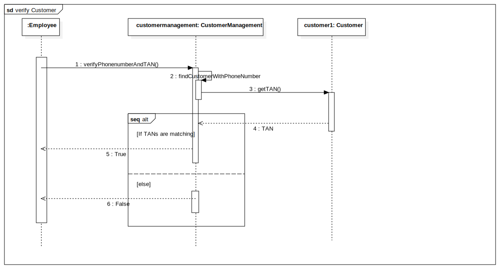

[cols="1h, 3"]
[[UC0820]]
|===
|ID                         |**<<UC0820>>**
|Name                       |specify Order PickupType
|Description               |The employee can specify if the customer wants the order to be delivered or rather pick up the order by himself.
|Actors                     |employee
|Trigger                    |gui (new-order-context -> checkbox)
|Requirements           a|The employee  has the role "CASHIER" or "BOSS".
|Essential Steps     a|
1. The employee checks the checkbox if the order is picked up by the customer.
|Extensions              |
|Functional Requirements     |<<F0820>>
|===

[cols="1h, 3"]
[[UC0830]]
|===
|ID                         |**<<UC0830>>**
|Name                       |add Product to Order
|Description               |The employee can add various predefined products from the inventory to the order.
|Actors                     |employee
|Trigger                    |gui (new-order-context -> product-info-chart -> quantity-dropdown)
|Requirements           a|The employee  has the role "CASHIER" or "BOSS".
|Essential Steps     a|
1. The employee navigates to the desired section of products.
2. The employee selects the desired quantity of the product in a dropdown menu of the products info-chart.
|Extensions              |
|Functional Requirements     |<<F0800>>, <<F0830>>
|===

[cols="1h, 3"]
[[UC0840]]
|===
|ID                         |**<<UC0840>>**
|Name                       |configure, add and reset CustomPizza
|Description               |The employee can configure a custom pizza via checkboxes, add this pizza to the order and reset the checkbox form.
|Actors                     |employee
|Trigger                    |
_configure:_ gui (new-order-context -> custom-pizza-form -> checkboxes)

_add:_ gui (new-order-context -> custom-pizza-form -> button)

_reset:_ gui (new-order-context -> custom-pizza-form -> button)
|Requirements           a|The employee  has the role "CASHIER" or "BOSS". The pizza can only be added if a minimal requirement of toppings has been selected.
|Essential Steps     a|
_configure:_ The employee navigates to the custom pizza form and selects the desired checkboxes (corresponding to toppings).

_add:_ The employee presses the "add" button in the form. In response the system adds a pizza with the entered specifications in the order.

_reset:_ The employee presses the "reset" button in the form. The form is thereupon cleared.
|Extensions              |
|Functional Requirements     |<<F0800>>, <<F0840>>
|===

[cols="1h, 3"]
[[UC0850]]
|===
|ID                         |**<<UC0850>>**
|Name                       |view Summary
|Description               |The employee can see a summary of all products (as well as custom pizzas) contained in the order.
|Actors                     |employee
|Trigger                    |gui (new-order-context -> summary-table-view)
|Requirements           a|The employee  has the role "CASHIER" or "BOSS".
|Essential Steps     a|
1. The employee navigates to the summary table.
|Extensions              |
|Functional Requirements     |<<F0850>>
|===

[cols="1h, 3"]
[[UC0860]]
|===
|ID                         |**<<UC0860>>**
|Name                       |delete from Summary
|Description               |The employee can delete entries in the summary and therefore also from the order.
|Actors                     |employee
|Trigger                    |gui (new-order-context -> summary-table-view -> table-entry -> button)
|Requirements           a|The employee  has the role "CASHIER" or "BOSS".
|Essential Steps     a|
1. The employee navigates to the desired product.
2. The employee presses the "delete" button.
3. The employee has to confirm his action inside a popup window which consequentially shows up.
4. The product is deleted.
|Extensions              |
|Functional Requirements     |<<F0800>>, <<F0860>>
|===

[cols="1h, 3"]
[[UC0870]]
|===
|ID                         |**<<UC0870>>**
|Name                       |cancel Order
|Description               |The employee can cancel a new order.
|Actors                     |employee
|Trigger                    |gui (new-order-context -> button)
|Requirements           a|The employee  has the role "CASHIER" or "BOSS".
|Essential Steps     a|
1. The employee presses to the "cancel" button.
2. The employee has to confirm his action inside a popup window which consequentially shows up.
3. The order gets cancelled and the system context changes to the order context.
|Extensions              |
|Functional Requirements     |<<F0870>>, <<F0721>>
|===

[cols="1h, 3"]
[[UC0880]]
|===
|ID                         |**<<UC0880>>**
|Name                       |confirm Order
|Description               |The employee can confirm the order, which is thereupon saved in the system. The employee also recieves details concerning the time estimations.
|Actors                     |employee
|Trigger                    |gui (new-order-context -> button)
|Requirements           a|The employee  has the role "CASHIER" or "BOSS".
|Essential Steps     a|
1. The employee presses the "confirm" button.
2. The employee has to confirm his action inside a popup window which consequentially shows up.
3. The system saves the order and assigns a chef and a driver. It also subtracts the free drink if the order surpasses 30€, calculates the time estimations and prints the invoice.
4. The system context changes to an order confirmed context where all order details and time estimations are displayed.
|Extensions              |
|Functional Requirements     |<<F0721>>, <<F0880>>, <<F0881>>, <<F0882>>, <<F0883>>, <<F0884>>
|===

[[sequence_diagram_confirm_order]]
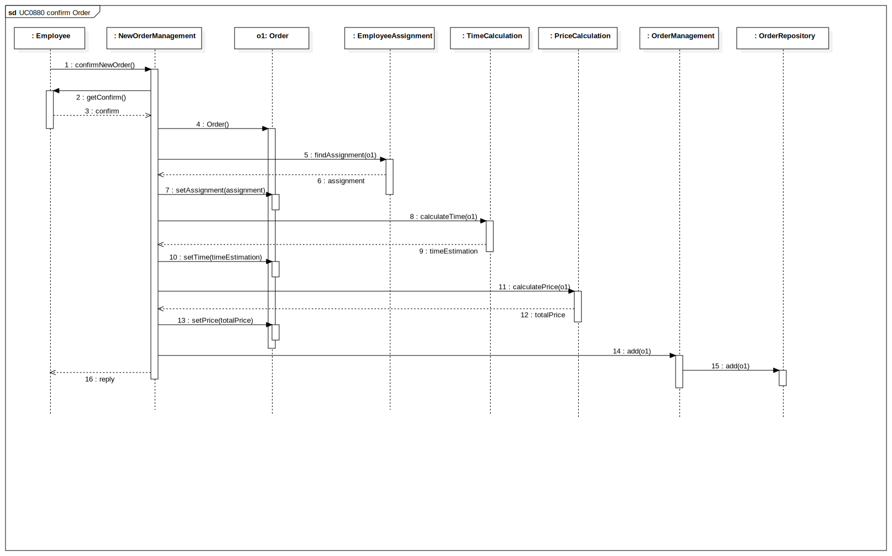

[cols="1h, 3"]
[[UC0890]]
|===
|ID                         |**<<UC0890>>**
|Name                       |print Invoice of Order
|Description               |The employee can print the invoice of a recent created order as a PDF file.
|Actors                     |employee
|Trigger                    |gui (new-order-context -> button) **<<UC0880>>**
|Requirements           a|The employee  has the role "CASHIER" or "BOSS".
|Essential Steps     a|
1. The employee presses the "confirm" button.
2. The invoice gets created saved as a PDF file.
|Extensions              |
|Functional Requirements     |<<F0884>>
|===

[[sequence_diagram_print_invoice]]
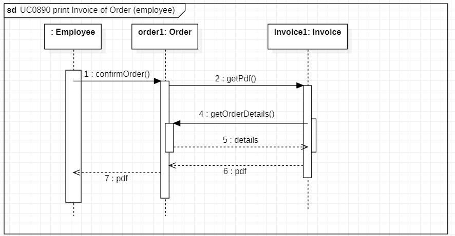

== Functional Requirements

=== Must-Have-Criteria

[options="header", cols="2h, 1, 3, 12"]
|===
|ID
|Version
|Name
|Description

//=================================================
//====================SYSTEM=======================
//=================================================
a|//ID: [[ID]]<<ID>>
[[F0010]]<<F0010>>
a|//Version
v.01
a|//Name
Authentication
a|//Description
The system is not accessible by an unauthenticated person. If the employee is existent in the system (<<EmployeeAccount>>), they shall be able to authenticate by providing the following information:

* Username
* Password

//=================================================
//=================CUSTOMER MGMT===================
//=================================================
a|//ID: [[ID]]<<ID>>
[[F0100]]<<F0100>>
a|//Version
v0.1
a|//Name
Customer Management
a|//Description
The system shall be able to persistently store customer-data (<<CustomerAccount>>) and manage their assigned TANs (<<TAN>>).

a|//ID: [[ID]]<<ID>>
[[F0110]]<<F0110>>
a|//Version
v0.1
a|//Name
Customer Registration
a|//Description
The system shall be able to provide an employee (<<CASHIER>>) the ability to register a new Customer (<<CustomerAccount>>).

The following information needs to be provided:

* First name
* Last name
* Telephone number
* Address

The system shall validate the provided data (<<F0111>>) and assign a unique id, a new and unique TAN (<<F0150>>) and initialize the lent-dishset-counter to 0.

a|//ID: [[ID]]<<ID>>
[[F0111]]<<F0111>>
a|//Version
v0.1
a|//Name
Validate Customer Registration
a|//Description
The system shall be able to validate the provided data of an unregistered customer.

The uniqueness of the account has to be guaranteed by the combination of names and telephone number. The employee shall be informed of any constraint violations.

//=================================================
//=================EMPLOYEE MGMT===================
//=================================================
a|//ID: [[ID]]<<ID>>
[[F0200]]<<F0200>>
a|//Version
v0.1
a|//Name
Employee Management
a|//Description
The system shall be able to persistently store employee-data (<<EmployeeAccount>>), provide their login-information (<<F0010>>) and manage their roles ([[CASHIER]]<<CASHIER>>, [[CHEF]]<<CHEF>>, [[DRIVER]]<<DRIVER>> and [[BOSS]]<<BOSS>>) within the system.

a|//ID: [[ID]]<<ID>>
[[F0210]]<<F0210>>
a|//Version
v0.1
a|//Name
Employee Registration
a|//Description
The system shall be able to provide the <<BOSS>> the ability to register a new employee (<<EmployeeAccount>>).

The following information needs to be provided:

* First name
* Last name
* Username
* Password

The system shall validate the provided data (<<F0211>>). The employee shall be registered in the system and they shall be able to authenticate (<<F0010>>) after successful validation.

a|//ID: [[ID]]<<ID>>
[[F0211]]<<F0211>>
a|//Version
v0.1
a|//Name
Validate Employee Registration
a|//Description
The system shall be able to validate the provided data of an unregistered employee .

The uniqueness of the username has to be guaranteed. The <<BOSS>> shall be informed of any constraint violations.

//=================================================
//===================INVENTORY=====================
//=================================================

a|//ID: [[ID]]<<ID>>
[[F0300]]<<F0300>>
a|//Version
v0.1
a|//Name
Inventory
a|//Description
The system shall persistently store data about products, ingredients and other inventory-items.

//=================================================
//===================DELIVERY======================
//=================================================
a|//ID: [[ID]]<<ID>>
[[F0520]]<<F0520>>
a|//Version
v0.1
a|//Name
assigned delivery chart view
a|//Description
The system shall provide a view of all deliveries with the state <<READYDELIVER>> and <<DELIVERING>>, with the current logged in employee matching the assigned employee in the order. The view should be presented as a chronological sorted chart view.

a|//ID: [[ID]]<<ID>>
[[F0530]]<<F0530>>
a|//Version
v0.1
a|//Name
change delivery state on button press
a|//Description
The system shall be able to change the state of a delivery, as cause of a press of a corresponding button.

//=================================================
//====================KITCHEN======================
//=================================================

a|//ID: [[ID]]<<ID>>
[[F0620]]<<F0620>>
a|//Version
v0.1
a|//Name
assigned pizza chart view
a|//Description
The system shall provide a view of all pizzas with the state <<OPEN>> and <<INOVEN>>, with the current logged in employee matching the assigned employee in the order. The view should be presented as a chronological sorted chart view.

a|//ID: [[ID]]<<ID>>
[[F0640]]<<F0640>>
a|//Version
v0.1
a|//Name
change pizza state on button press
a|//Description
The system shall be able to change the state of a pizza, by the of a press of the corresponding button.

a|//ID: [[ID]]<<ID>>
[[F0650]]<<F0650>>
a|//Version
v0.1
a|//Name
countdown timer
a|//Description
The system shall provide the functionality to activate a countdown timer with a given time. The timer periodically provides the current time and once a signal of the expiration.

//=================================================
//=====================ORDER=======================
//=================================================
a|//ID: [[ID]]<<ID>>
[[F0700]]<<F0700>>
a|//Version
v0.1
a|//Name
Order
a|//Description
The system shall persistently store all Orders which where successfully created. The system shall also offer details of any order, like the [[OPEN]] [[PENDING]] [[READYDELIVER]] [[DELIVERING]] [[READYPICKUP]] [[COMPLETED]] state, the menu and the customer.

a|//ID: [[ID]]<<ID>>
[[F0710]]<<F0710>>
a|//Version
v0.1
a|//Name
Redirect to NewOrder
a|//Description
The system shall be able to change the application context to the NewOrder page by the press of a button.

a|//ID: [[ID]]<<ID>>
[[F0721]]<<F0721>>
a|//Version
v0.1
a|//Name
verification popup
a|//Description
The system shall be able to display a verification popup window in which can be decided if the current action should be continued. <<F0721>>

//=================================================
//===================NEW ORDER=====================
//=================================================
a|//ID: [[ID]]<<ID>>
[[F0800]]<<F0800>>
a|//Version
v0.1
a|//Name
NewOrder
a|//Description
The system shall be able to interactively save and display data which is then used to create a new <<OPEN>> order.

a|//ID: [[ID]]<<ID>>
[[F0810]]<<F0810>>
a|//Version
v0.1
a|//Name
Customer verification
a|//Description
The system shall provide a feature to verify customer credentials. The employee has to provide a phone number and a TAN. The system looks up all customers (<<F0100>>) with the phone number and compares the TAN with any found customer. The system returns a confirmation if a match was found and a rejection if no match was found.

a|//ID: [[ID]]<<ID>>
[[F0820]]<<F0820>>
a|//Version
v0.1
a|//Name
process Pickup types
a|//Description
The system shall process orders differently depending on their pickup type. Orders, which are picked up by the customer, get a 10 percent discount and after all components of the order are READY, they enter the state <<READYPICKUP>>, rather the state <<READYDELIVER>>. Furthermore, <<READYPICKUP>> orders do not get scheduled in the delivery.

a|//ID: [[ID]]<<ID>>
[[F0830]]<<F0830>>
a|//Version
v0.1
a|//Name
update Order on dropdown selection
a|//Description
The system shall update the order (especially the quantity of toppings) dynamically, whenever a dropdown menu is selected. Furthermore, the view (<<F0850>>) should be dynamically updated.

a|//ID: [[ID]]<<ID>>
[[F0840]]<<F0840>>
a|//Version
v0.1
a|//Name
create custom Pizza
a|//Description
The system shall be able to read out the toppings of the custom pizza form, create a pizza based on the input, add the pizza to the order and further update the view (<<F0800>>, <<F0850>>).

a|//ID: [[ID]]<<ID>>
[[F0880]]<<F0880>>
a|//Version
v0.1
a|//Name
create Order
a|//Description
The system shall be able to create and persistently store an order which is currently configured inside the new order context.

a|//ID: [[ID]]<<ID>>
[[F0881]]<<F0881>>
a|//Version
v0.1
a|//Name
employee assignment
a|//Description
The system shall automatically assign a chef and a driver (<<F0820>>), based on the current distribution of tasks, with the aim to minimize the processing time of the order.

a|//ID: [[ID]]<<ID>>
[[F0882]]<<F0882>>
a|//Version
v0.1
a|//Name
time calculation
a|//Description
The system shall accumulate all waiting, processing and delivery times, based on the assigned employees and return the total estimated time.

a|//ID: [[ID]]<<ID>>
[[F0883]]<<F0883>>
a|//Version
v0.1
a|//Name
price calculation
a|//Description
The system shall accumulate the prices of all its components. Further it should count in the 10 percent discount if the order is picked up by the customer (<<F0820>>), as well as the discount of a drink if the total price is over 30€. The system shall return this total to the employee.

a|//ID: [[ID]]<<ID>>
[[F0884]]<<F0884>>
a|//Version
v0.1
a|//Name
print invoice
a|//Description
The system shall be able to create a PDF file with a given order, representing the invoice for the order. The invoice should contain: the used TAN, the new created TAN, all Order components with their prices, all discounts and the total amount. The system shall save this file inside a specified folder.

|===

=== Can-Have-Criteria
//=================================================
//=================CUSTOMER MGMT===================
//=================================================
[options="header", cols="2h, 1, 3, 12"]
|===
|ID
|Version
|Name
|Description

a|//ID: [[ID]]<<ID>>
[[F0120]]<<F0120>>
a|//Version
v0.1
a|//Name
Delete Customer-Account
a|//Description
The system shall provide the <<BOSS>> and the <<CASHIER>> the ability to permanently delete a customer's stored data.

The system shall be able to display a verification popup window in which can be decided if the current action should be continued. <<F0721>>

a|//ID: [[ID]]<<ID>>
[[F0130]]<<F0130>>
a|//Version
v0.1
a|//Name
View all Customer-Accounts
a|//Description
The system shall provide an employee a searchable view (<<F0131>>) of stored <<CustomerAccounts>> and display the customer's information. The data shall be provided in a table view.

a|//ID: [[ID]]<<ID>>
[[F0131]]<<F0131>>
a|//Version
v0.1
a|//Name
Search Customer-Accounts
a|//Description
The system shall provide an employee the ability to search for specific <<CustomerAccounts>> by entering a search query in the search bar above the table view.

a|//ID: [[ID]]<<ID>>
[[F0140]]<<F0140>>
a|//Version
v0.1
a|//Name
Edit Customer-Account
a|//Description
The system shall provide the <<BOSS>> and the <<CASHIER>> the ability to edit <<CustomerAccount>> information.

The system shall be able to display a verification popup window in which can be decided if the current action should be continued. <<F0721>>

a|//ID: [[ID]]<<ID>>
[[F0150]]<<F0150>>
a|//Version
v0.1
a|//Name
Create new TAN
a|//Description
The system should be able to discard a customer's current TAN and assign a new and unique one.

The system shall be able to display a verification popup window in which can be decided if the current action should be continued. <<F0721>>

//=================================================
//=================EMPLOYEE MGMT===================
//=================================================
a|//ID: [[ID]]<<ID>>
[[F0220]]<<F0220>>
a|//Version
v0.1
a|//Name
Delete Employee-Account
a|//Description
The system shall provide the <<BOSS>> the ability to permanently delete an employee’s stored data, thus making them unable to interact with the system.

The system shall be able to display a verification popup window in which can be decided if the current action should be continued. <<F0721>>

a|//ID: [[ID]]<<ID>>
[[F0230]]<<F0230>>
a|//Version
v0.1
a|//Name
View all Employee-Accounts
a|//Description
The system shall provide the <<BOSS>> a view of stored <<EmployeeAccounts>> and display the employee’s information. The data shall be provided in a table view.

a|//ID: [[ID]]<<ID>>
[[F0240]]<<F0240>>
a|//Version
v0.1
a|//Name
Edit Employee-Account
a|//Description
The system shall provide the <<BOSS>> the ability to edit <<EmployeeAccount>> information.

The system shall be able to display a verification popup window in which can be decided if the current action should be continued. <<F0721>>

a|//ID: [[ID]]<<ID>>
[[F0250]]<<F0250>>
a|//Version
v0.1
a|//Name
Edit Employee-Role
a|//Description
The system shall provide the <<BOSS>> the ability to assign a role to an employee via a dropdown-menu within the table view. The selectable roles are: <<CASHIER>>, <<CHEF>> and <<DRIVER>>, however, not the <<BOSS>> role.

//=================================================
//===================INVENTORY=====================
//=================================================
a|//ID: [[ID]]<<ID>>
[[F0310]]<<F0310>>
a|//Version
v0.1
a|//Name
View inventory
a|//Description
The system shall provide the <<BOSS>> a searchable view (<<F0311>>) of stored inventory-items and display the item's information. The data shall be provided in a table view.

a|//ID: [[ID]]<<ID>>
[[F0311]]<<F0311>>
a|//Version
v0.1
a|//Name
Search inventory
a|//Description
The system shall provide the <<BOSS>> the ability to search for specific inventory-items by entering a search query in the search bar above the table view.

a|//ID: [[ID]]<<ID>>
[[F0320]]<<F0320>>
a|//Version
v0.1
a|//Name
Add item to inventory
a|//Description
The system shall provide the <<BOSS>> the ability to create a new inventory-item.

Following information needs to be provided:

* Name
* Item-type
* Price

The system shall validate the provided data (<<F0321>>). The item should now be usable within an order and behaves according to the type.

a|//ID: [[ID]]<<ID>>
[[F0321]]<<F0321>>
a|//Version
v0.1
a|//Name
Validate item Registration
a|//Description
The system shall be able to validate the provided data of a new inventory-item.

The uniqueness of the name has to be guaranteed. The <<BOSS>> shall be informed of any constraint violations.

//overloading the function to also check pizza preset correctness?: unique name, valid ingrediens and toppings, valid amount of ingrediens and toppings?

a|//ID: [[ID]]<<ID>>
[[F0330]]<<F0330>>
a|//Version
v0.1
a|//Name
Edit item entry
a|//Description
The system shall provide the <<BOSS>> the ability to edit the stored information of an already existing item. They shall be able to edit the following information:

* Name
* Item-type
* Price
* Amount (?)

The system shall validate this newly entered data (<<F0321>>).

The system shall be able to display a verification popup window in which can be decided if the current action should be continued. <<F0721>>

a|//ID: [[ID]]<<ID>>
[[F0340]]<<F0340>>
a|//Version
v0.1
a|//Name
Delete item entry
a|//Description
The system shall provide the <<BOSS>> the ability to permanently delete an already existing item from the inventory. The item will no longer be available for usage in the system.

The system shall be able to display a verification popup window in which can be decided if the current action should be continued. <<F0721>>

a|//ID: [[ID]]<<ID>>
[[F0350]]<<F0350>>
a|//Version
v0.1
a|//Name
create Pizza Preset
a|//Description
The system shall allow the user (<<BOSS>>) to create a new, not already existing, pizza preset. The newly created preset must have a unique name and may consist of several, already existing, ingredients and toppings.

//=================================================
//===================ANALYTICS=====================
//=================================================
a|//ID: [[ID]]<<Id>>
[[F0400]]<<F0400>>
a|//Version
v0.1
a|//Name
Analytics
a|//Description
The system shall provide the <<BOSS>> with convenient ways to display the stored data from the <<OrderRepository>>.

a|//ID: [[ID]]<<ID>>
[[F0410]]<<F0410>>
a|//Version
v0.1
a|//Name
View OrderTable
a|//Description
The system shall be able to provide a sortable view of stored COMPLETED orders <<F0400>>. The data shall be provided in a table view.

a|//ID: [[ID]]<<ID>>
[[F0420]]<<F0420>>
a|//Version
v0.1
a|//Name
Print Invoice of Order
a|//Description
The system shall be able to display a view of an order's invoice to the <<BOSS>>. This view should be printable from within the browser used to display it.

a|//ID: [[ID]]<<ID>>
[[F0430]]<<F0430>>
a|//Version
v0.1
a|//Name
Generate SalesGraph
a|//Description
The system shall be able to generate sales graphs from the dataset of completed orders (<<F0400>>) for a given time span. The graph depicts the sales as a function of time.

a|//ID: [[ID]]<<ID>>
[[F0431]]<<F0431>>
a|//Version
v0.1
a|//Name
View SalesGraph
a|//Description
The system shall be able to display generated sales graphs to the <<BOSS>>. The user shall be able to select the time span.

a|//ID: [[ID]]<<ID>>
[[F0440]]<<F0440>>
a|//Version
v0.1
a|//Name
Generate TimesGraph
a|//Description
The system shall be able to generate graphs, that show the average time a pizza is in a given state of processing, from the dataset of completed orders (<<F0400>>).
These graphs should be able to get generated for the different states a pizza goes through, for different time spans.

a|//ID: [[ID]]<<ID>>
[[F0441]]<<F0441>>
a|//Version
v0.1
a|//Name
View TimesGraph
a|//Description
The system shall be able to display generated times graphs to the <<BOSS>>, who shall be able to choose a time span and a state to view.

//=================================================
//====================DELIVERY=====================
//=================================================
a|//ID: [[ID]]<<ID>>
[[F0510]]<<F0510>>
a|//Version
v0.1
a|//Name
delivery table view
a|//Description
The system shall provide a view of all deliveries with the state <<READYDELIVER>> and <<DELIVERING>>, based on the orders with the state <<READYDELIVER>> and <<DELIVERING>> (<<F0700>>). The view should be presented as a chronological sorted table view.

//=================================================
//====================KITCHEN======================
//=================================================
a|//ID: [[ID]]<<ID>>
[[F0610]]<<F0610>>
a|//Version
v0.1
a|//Name
pizza table view
a|//Description
The system shall provide a view of all pizzas with the state <<OPEN>> and [[INOVEN]]<<INOVEN>>, based on the orders with the state <<OPEN>> and <<PENDING>> (<<F0700>>). The view should be presented as a chronological sorted table view.

//=================================================
//=====================ORDER=======================
//=================================================
a|//ID: [[ID]]<<ID>>
[[F0720]]<<F0720>>
a|//Version
v0.1
a|//Name
delete OPEN Order
a|//Description
The system shall provide the <<BOSS>> and the <<CASHIER>> the ability to permanently delete an order with the state <<OPEN>>, via a button in the order table view (<<F0730>>).

The system shall be able to display a verification popup window in which can be decided if the current action should be continued. <<F0721>>

a|//ID: [[ID]]<<ID>>
[[F0730]]<<F0730>>
a|//Version
v0.1
a|//Name
all orders table view
a|//Description
The system shall provide a sortable view of current orders <<F0700>>. The data shall be provided in a table view.

a|//ID: [[ID]]<<ID>>
[[F0740]]<<F0740>>
a|//Version
v0.1
a|//Name
order details popup window
a|//Description
The system shall be able to display a popup window. This view should contain details of an specific order depending on which details button has been pressed.

//=================================================
//===================NEW ORDER=====================
//=================================================
a|//ID: [[ID]]<<ID>>
[[F0850]]<<F0850>>
a|//Version
v0.1
a|//Name
summary view
a|//Description
The system shall display dynamically the order details in a table view (<<F0800>>).

a|//ID: [[ID]]<<ID>>
[[F0860]]<<F0860>>
a|//Version
v0.1
a|//Name
update Order on button press
a|//Description
The system shall update the order (especially the quantity of toppings) dynamically, if a delete button is pressed. Further the view (<<F0850>>) should be dynamically updated.

a|//ID: [[ID]]<<ID>>
[[F0870]]<<F0870>>
a|//Version
v0.1
a|//Name
cancel Order
a|//Description
The system shall provide the functionality to delete the order which is currently being configured.

|===

== Non-Functional Requirements

=== Quality Goals

Dokumentieren Sie in einer Tabelle die Qualitätsziele, welche das System erreichen soll, sowie deren Priorität.

Priority from 1 to 5

[options="header", cols="1h, ^1h , 3"]
|===
|Quality Demand           | Priority | Explanation
|Maintainability          | 3 | The ease with which the software can be modified to correct faults, improve performance or other attributes.
|Security                 | 4 | The principle that every user has only certain access to the software and therefore can only interact with the system in an intended and authorized way.
|Visual Appeal            | 2 | The aim to provide an appealing user inteface.
|Expressive user interface| 4 | The aim to pronounce important features of the software and to keep the user inteface clean.
|Robust Usability         | 4 | The ability of the software to cope with errors during execution, as well as to respond to every possible entry with an well defined response.
|Fast Usability           | 5 | The principle that more often used features are especially easy to access, as well as to provide fast navigations within the software.
|===

=== Concrete Non-Functional Requirements

Beschreiben Sie Nicht-Funktionale Anforderungen, welche dazu dienen, die zuvor definierten Qualitätsziele zu erreichen.
Achten Sie darauf, dass deren Erfüllung (mindestens theoretisch) messbar sein muss.

[options="header", cols="2h, 1, 3, 12"]
|===
|ID
|Version
|Name
|Description

|[[NF0001]]<<NF0001>>
|v0.1
|Usage of Frameworks
a|
The software structure should be provided by an Framework.

|[[NF0002]]<<NF0002>>
|v0.1
|Testing
a|
The software should have a test-coverage of 80%.

|[[NF0003]]<<NF0003>>
|v0.1
|Password storage
a|
Passwords of Users shall only be stored as hash-values to prevent theft.

|[[NF0004]]<<NF0004>>
|v0.1
|Authenticated Access
a|
The access of unauthenticated features shall be denied by the front-end and the back-end.

|[[NF0005]]<<NF0005>>
|v0.1
|Hierarchye of users
a|
Access to other features can only be granted by a user with higher authority.

|[[NF0006]]<<NF0006>>
|v0.1
|High contrast colors
a|
The GUI shall be colored with high contrast colors

|[[NF0007]]<<NF0007>>
|v0.1
|Uniform design
a|
The same GUI components like table-, chart-, graph-views shall be designed in a uniform way.

|[[NF0008]]<<NF0008>>
|v0.1
|Indentifyable interaction points
a|
All points of interaction with the software should be designed and colorized in a similar and overall unique fashion.

|[[NF0009]]<<NF0009>>
|v0.1
|Navigation bar
a|
An all-overlaying navigion bar should be implemented which provide quick access to all features in the software.

|[[NF0010]]<<NF0010>>
|v0.1
|Separation of Concerns
a|
All service and management methods shall be outsourced in separate classes, to improve testability. The (Spring-)MVC-pattern
shall be strictly respected.

|[[NF0011]]<<NF0011>>
|v0.1
|Separation of labels
a|
All labels, as strings and images shall be defined inside a separate file and further be referenced.

|===

== GUI Prototype
// // Links for GitHub
//ifdef::env-github[]
//<<gui_prototype.adoc#gui_prototype, GUI Preview & Dialog map>>
//endif::[]
// // includes for AsciiDoc processing
//ifndef::env-github[]
//include::./gui_prototype.adoc[]
//endif::[]

=== GUI Preview
This sections gives an overview of how the GUI could look like, once finished. The prototype is made with MS Powerpoint.

==== Login
[[gui_login]]
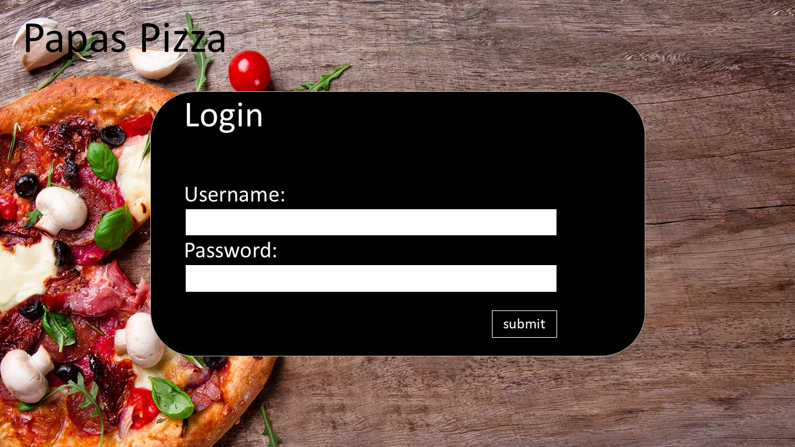

The login page redirects each employee to their role-related frontpage, e.g. an employee who works as chef (role: 'KITCHEN')
will be redirected to the ``/kitchen`` page.

==== Navbar
[[gui_navbar]]
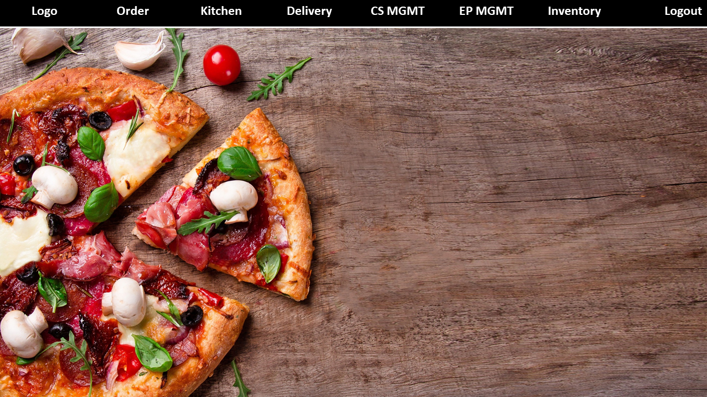
Employees will not be able to see nor access the tabs dedicated to the 'BOSS', specifically 'EP MGMT', 'Inventory' & 'Analytics' will be hidden. +
They can see tabs of other roles (like 'Order', 'Kitchen', 'Delivery') though, but not edit.

==== Order
[[gui_order]]
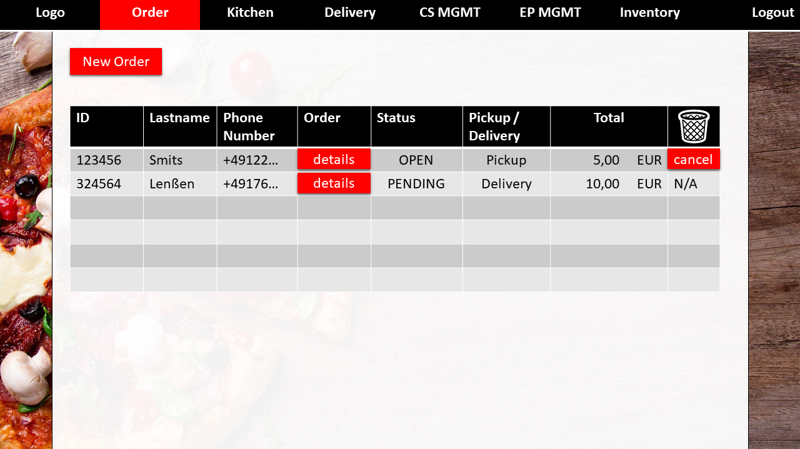

The ``New Order`` button redirects the employee to a new page ``/new_order`` as seen in the next image.

==== New Order
[[gui_new_order]]
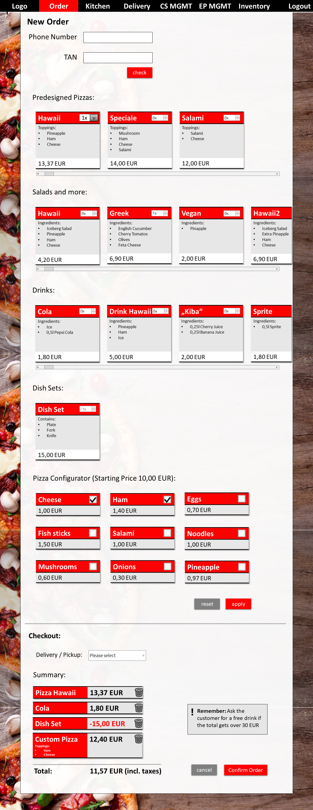

At the top of the ``New Order`` page the employee must check the customers phone and TAN against the database entries (see <<UC0810,UC0810>>).

Once everything is selected that should be part of the order, the employee is redirected back to the ``/order`` page via the ``Confirm Order`` button (see <<UC0880,UC0880>>).

==== Kitchen
[[gui_kitchen]]
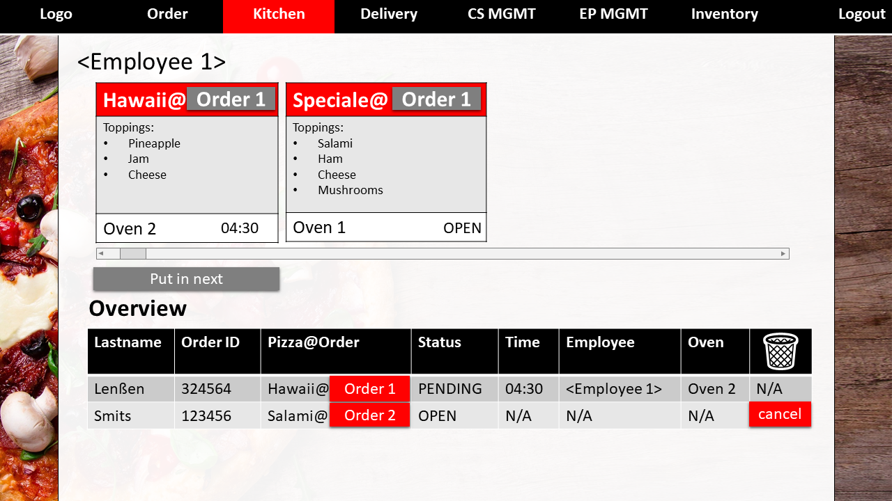

==== Delivery
[[gui_delivery]]
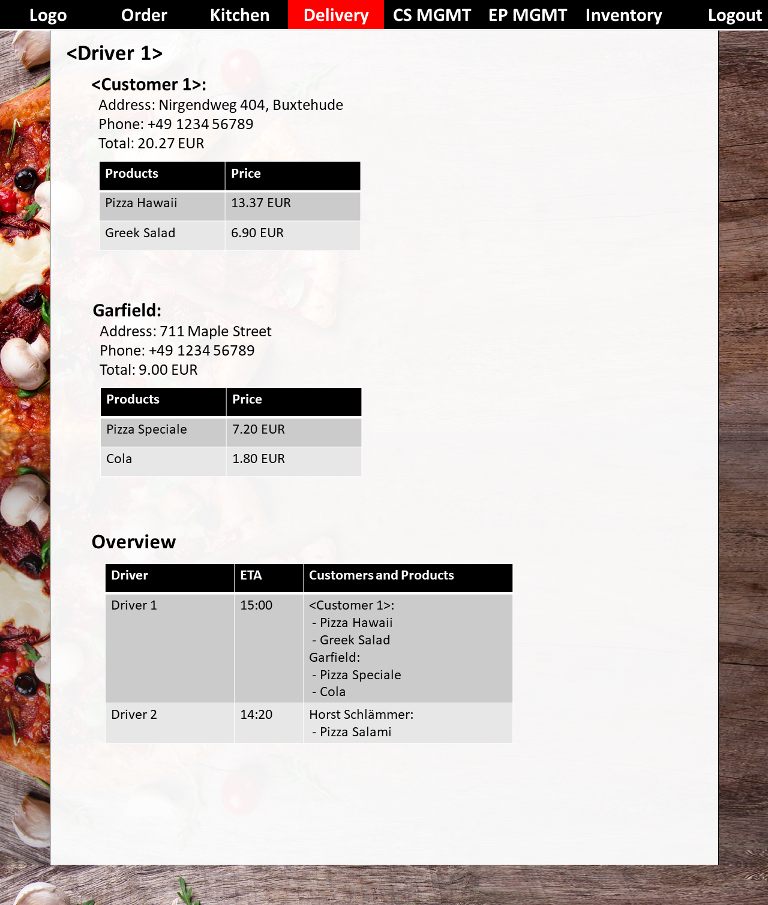

==== Customer Management
[[gui_cs_mgmt]]
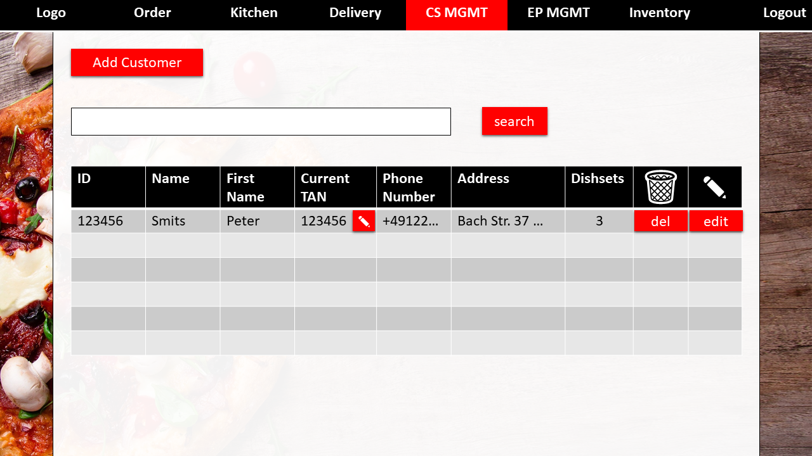

==== Employee Management
[[gui_ep_mgmt]]
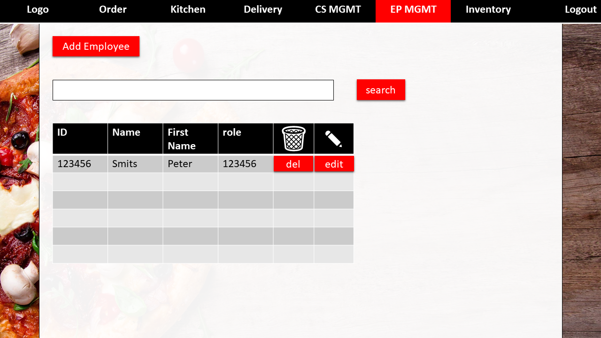

==== Inventory
[[gui_inv_1]]
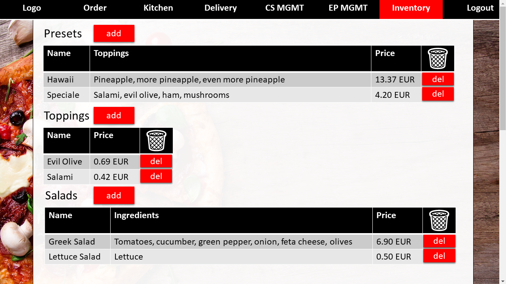

[[gui_inv_2]]
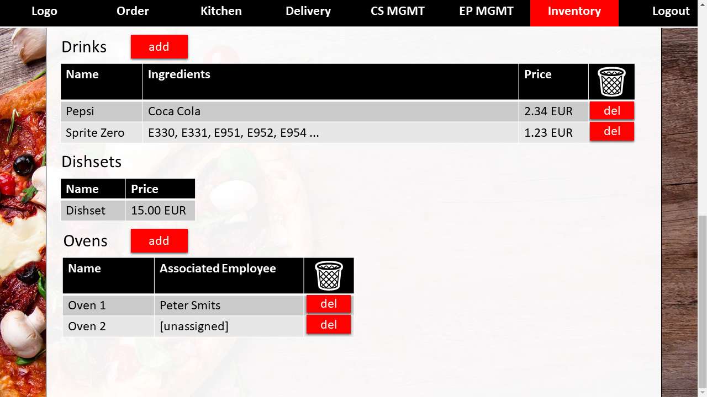

The ``Add`` buttons allow you to add an inventory item of the specific category. Dishsets may not be added.

==== Analytics
[[gui_analytics_1]]
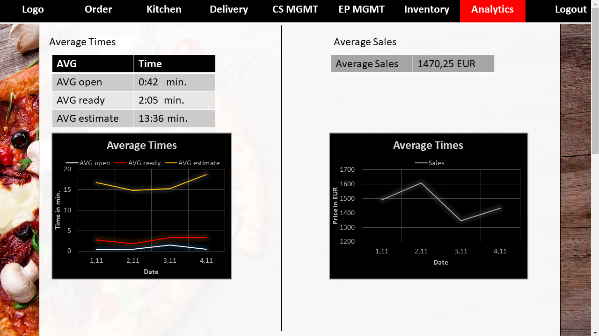

[[gui_analytics_2]]
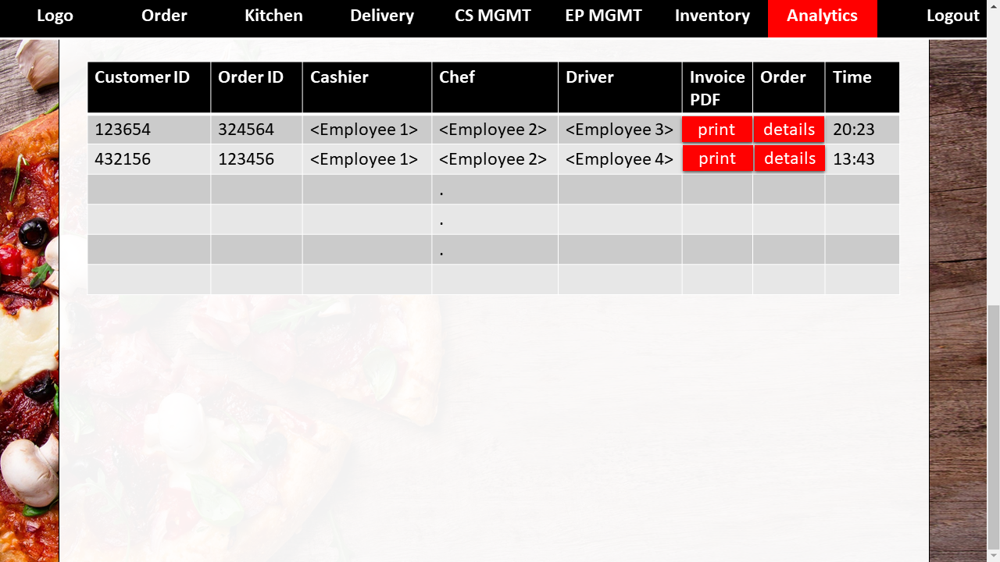

=== Dialogmap
[[gui_dialogmap]]
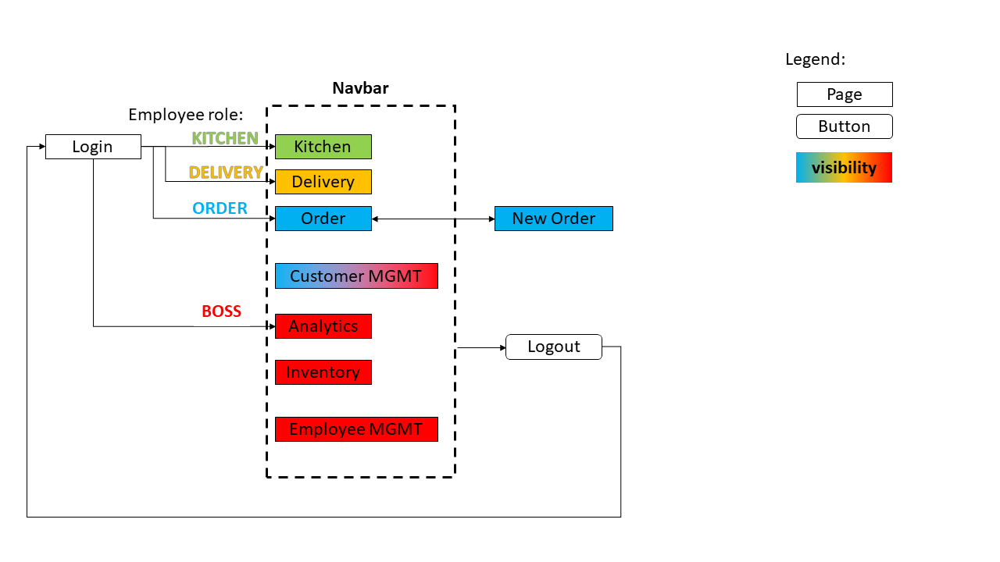

== Data Model

=== Class Diagram
[[class_diagram]]
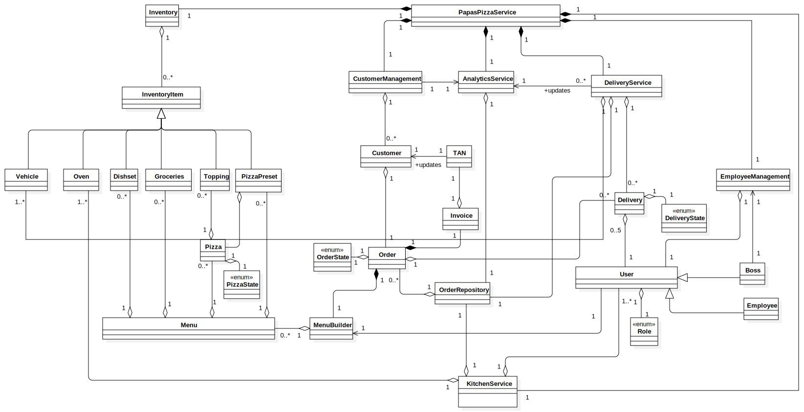

=== Classes and Enumerations
The following table gives an overview of the classes/enumerations used in the domain model.
Therefore, this section is a subset of the <<Glossary, glossary>> and shall be used to provide every stakeholder a common understanding of central terms and concepts of the domain of the system.

//Note: you could do it like this, but this might not work with mutli-line texts. Consult the documentation for additional information

// Konnte Flussdiagramm mit States nicht finden, daher würde ich bennet bitten diese Punkte einzutragen

// See http://asciidoctor.org/docs/user-manual/#tables
[options="header", cols="1h, 4"]
[[classes_enumerations]]
|===
|Class/Enumeration      |Description
|PapasPizzaService              | Central class of the system representing "Papas Pizza"-Service itself.
|Inventory                   | An Inventory represents a storage for "Papas Pizza"-Service. Can be seen like a warehouse and operating resources in this project.
|InventoryItem                   | Represents the quantity of a Item in the inventory.
|Vehicle                  | Is an object for delivery (operating resources) 
|Oven                  | An object in the kitchen (operating resources). 
|Dishset                 | An object that can be selected in the MenuBuilder.
|Groceries                 | An objects that can be selected in the MenuBuilder (drinks etc.).
|Topping                 | Can be selected for the pizza.
|PizzaPreset                    | A pre-built selection of toppings for a pizza.
|Pizza                | An empty pizza object that can be individually filled with toppings.
|PizzaState            |This status represents the current processing step of the pizza. +
_OPEN_: +
_INOVEN_: +
_COMPLETED_: +
|Menu                | This class creates the customer menu.
|MenuBuilder                   | The menu class transfers the selection to the menu builder class.
|Order              | An order is used to represent an order. This can only be issued by one employee and has multiple states.
|OrderState                  | This status represents the current processing step of the order +
_OPEN_: +
_PENDING_: +
_READYDELIVER_: +
_READYPICKUP_: +
_INDELIVERY_: +
_COMPLETED_: +
_CANCELLED_: 
|Invoice              | An overview that includes the TAN, the order and price.
|TAN              | A randomly generated number that is required for the ordering process.
|Customer              | A class that has important customer data.
|CustomerManagement              | Manages the customer data and forms an interface to the Salespoint database.
|AnalyticsService              | Manages the company's finances and give a recommendation every quarter.
|OrderRepository              | Orders are collected and transferred to Delivery and AnalyticsService.
|KitchenService              | Processes the orders and assigns them to employees.
|User              | Boss and Employee inherit from this class (Superclass).
|Role              | It makes division into the departments +
_Employee_: +
_Boss_: +
|Boss              | A user that is registered as an administrator/boss.
|Employee              | A user that is registered as a Employee.
|EmployeeManagement               | Assigns employees to departments / tasks.
|DeliveryService              | Manages the deliveries and transfers them to the AnalyticsService class. 
|Delivery              | Allocates the orders to the employees and contains a current status.
|DeliveryState            |Diese Statue repräsentiert den aktuellen Verarbeitungsschritt der Lieferung. +
_READYDELIVER_: +
_INDELIVERY_: +
_COMPLETED_:

|===

== Acceptance Test Cases

Acceptence tests provide a foundation to ensure that the software functions as expected and required.

:Pre: Precondition(s)
:Event: Event
:Result: Expected Result

//--SYSTEM------------------------------

[[AT0010]]
[cols="1h, 4"]
|===
|ID            |**<<AT0010>>**
|Use Case      |<<UC0010>>
|{Pre}        a|The system has an already existing User (``BOSS``)
|{Event}      a|
An unauthenticated user enters the credentials of the ``BOSS`` account within the login window and presses the "Login" button.
|{Result}     a|
- The user is now authenticated as the ``BOSS``
- The user is redirected to the "Analytics" window
- The ``BOSS`` has access to all functionalities within the system
|===

[[AT0011]]
[cols="1h, 4"]
|===
|ID            |**<<AT0011>>**
|Use Case      |<<UC0010>>
|{Pre}        a|The system has an already existing employee
|{Event}      a|
An unauthenticated user enters their credentials within the login window and presses the "Login" button.
|{Result}     a|
- The user is now authenticated as their assigned roll
- The user is redirected to their corresponding role-window
- The user has access to their role's designated functionalities within the system
|===

[[AT0020]]
[cols="1h, 4"]
|===
|ID            |**<<AT0020>>**
|Use Case      |<<UC0020>>
|{Pre}        a|An authenticated user (employee or Boss) is using the system
|{Event}      a|The authenticated user presses "Log out"
|{Result}     a|
- They become unauthenticated
- They lose access to all functionality
|===

//--CUSTOMER-MANAGEMENT----------------

[[AT0110]]
[cols="1h, 4"]
|===
|ID            |**<<AT0110>>**
|Use Case      |<<UC0110>>
|{Pre}        a|An authenticated user (``CASHIER`` or ``BOSS``) is using the system
|{Event}      a|The user creates a new ``CustomerAccount``
|{Result}     a|
- The user opens the new CustomerAccount form and enters the required data
- A new TAN will automatically be assigned to the Customer
- After successfully filling out the form, the ``CustomerAccount`` will be created, if there's no account with the same name and telephone number in the system
|===

[[AT0120]]
[cols="1h, 4"]
|===
|ID            |**<<AT0120>>**
|Use Case      |<<UC0130>>
|{Pre}        a|An authenticated user (``CASHIER`` or ``BOSS``) is using the system
|{Event}      a|The user views a list of all CustomerAccounts
|{Result}     a|
- A list of all registered CustomerAccounts is displayed as a table
- From there the user can view all information of any given customer (including TAN, telephone number, ...)
|===

//-EMPLOYEE-MANAGEMENT--------------------

[[AT0210]]
[cols="1h, 4"]
|===
|ID            |**<<AT0210>>**
|Use Case      |<<UC0210>>
|{Pre}        a|The ``BOSS`` is using the system
|{Event}      a|The ``BOSS`` creates a new ``EmployeeAccount``
|{Result}     a|
- The ``BOSS`` opens the new EmployeeAccount form and enters the required data and assigns their roll
- After successfully filling out the form, the EmployeeAccount will be created, if there's no account with the same username in the system
- The created employee can now access all of their role's designated functionalities within the system
|===

[[AT0220]]
[cols="1h, 4"]
|===
|ID            |**<<AT0220>>**
|Use Case      |<<UC0220>>
|{Pre}        a|The ``BOSS`` is using the system
|{Event}      a|The ``BOSS`` views a list of all EployeeAccounts
|{Result}     a|
- A list of all registered EmployeeAccounts is displayed as a table
- From there the ``BOSS`` can view all information of any given employee
|===

//--INVENTORY------------------

[[AT0310]]
[cols="1h, 4"]
|===
|ID            |**<<AT0310>>**
|Use Case      |<<UC0320>>
|{Pre}        a|The ``BOSS`` is using the system
|{Event}      a|The ``BOSS`` creates a new InventoryItem
|{Result}     a|
- The ``BOSS`` opens the new InventoryItem form and enters the required data and item-type
- After successfully filling out the form, the inventory entry will be created, if there's no item with the same name in the system
- The created item can now be used in orders
|===

[[AT0320]]
[cols="1h, 4"]
|===
|ID            |**<<AT0320>>**
|Use Case      |<<UC0310>>
|{Pre}        a|The ``BOSS`` is using the system
|{Event}      a|The ``BOSS`` views a list of all InventoryItems
|{Result}     a|
- A list of all registered InventoryItems is displayed as a table
- From there the ``BOSS`` can view all information of any given item
|===

//--ANALYTICS-------------------

[[AT0410]]
[cols="1h, 4"]
|===
|ID            |**<<AT0410>>**
|Use Case      |<<UC0410>>
|{Pre}        a|The ``BOSS`` is using the system
|{Event}      a|The ``BOSS`` views a list of all ``COMPLETED`` orders
|{Result}     a|
- A list of all ``COMPLETED`` orders is displayed as a table
- From there the ``BOSS`` can view all information of any given order
|===

[[AT0420]]
[cols="1h, 4"]
|===
|ID            |**<<AT0420>>**
|Use Case      |<<UC0430>>
|{Pre}        a|The ``BOSS`` is using the system
|{Event}      a|The ``BOSS`` views a graph of recent sales figures
|{Result}     a|
- A graph of all sales within a certain time span is displayed
- From there the ``BOSS`` can adjust the viewed time span
|===

[[AT0430]]
[cols="1h, 4"]
|===
|ID            |**<<AT0430>>**
|Use Case      |<<UC0440>>
|{Pre}        a|The ``BOSS`` is using the system
|{Event}      a|The ``BOSS`` views a graph of average process times
|{Result}     a|
- A graph of average times of a certain order state is displayed
- From there the ``BOSS`` can adjust the viewed state as well as the selected time span
|===

//--DELIVERY---------------------------

[[AT0510]]
[cols="1h, 4"]
|===
|ID            |**<<AT0510>>**
|Use Case      |<<UC0520>>
|{Pre}        a|An authenticated user (``DRIVER``) is using the system
|{Event}      a|The user views a personalised list of their assigned deliveries
|{Result}     a|
- A list of all pending deliveries is displayed as a table
|===

[[AT0520]]
[cols="1h, 4"]
|===
|ID            |**<<AT0520>>**
|Use Case      |<<UC0530>>
|{Pre}        a|An authenticated user (``DRIVER``) is using the system
|{Event}      a|The user marks a delivery from their personalised list as ``COMPLETED``
|{Result}     a|
- The delivery disappears from the list
- The order is saved as a ``COMPLETED`` order in the ``OrderRepository``
|===

//--KITCHEN----------------------

[[AT0610]]
[cols="1h, 4"]
|===
|ID            |**<<AT0610>>**
|Use Case      |<<UC0610>>
|{Pre}        a|An authenticated user is using the system
|{Event}      a|The user views list of all ``OPEN`` and ``INOVEN`` Pizzas
|{Result}     a|
- A list of all ``OPEN`` and ``INOVEN`` Pizzas is displayed as a table
|===

[[AT0620]]
[cols="1h, 4"]
|===
|ID            |**<<AT0620>>**
|Use Case      |<<UC0620>>, <<UC0650>>
|{Pre}        a|An authenticated user (``CHEF``) is using the system
|{Event}      a|The user views a personalised list of their assigned Pizzas
|{Result}     a|
- A list of all their assigned Pizzas
- The first Pizza in the list is the one designated to go in the oven next
- There's also a timer counting down the baking time of the ``INOVEN`` Pizza
|===

//--ORDER------------------

[[AT0710]]
[cols="1h, 4"]
|===
|ID            |**<<AT0710>>**
|Use Case      |<<UC0710>>
|{Pre}        a|An authenticated user (``CASHIER`` or ``BOSS``) is using the system
|{Event}      a|The user presses "create new order" button
|{Result}     a|
- The user gets directed to the NewOrder form
|===

[[AT0720]]
[cols="1h, 4"]
|===
|ID            |**<<AT0720>>**
|Use Case      |<<UC0730>>
|{Pre}        a|An authenticated user is using the system
|{Event}      a|The user views a list of all current orders
|{Result}     a|
- A list of all orders that are not ``COMPLETED`` is displayed as a table
|===

[[AT0730]]
[cols="1h, 4"]
|===
|ID            |**<<AT0730>>**
|Use Case      |<<UC0730>>
|{Pre}        a|An authenticated user is using the system
|{Event}      a|The user views the details of a specific order
|{Result}     a|
- A popup window containing all details of the order is displayed
|===

//--NEWORDER-------------------

[[AT0810]]
[cols="1h, 4"]
|===
|ID            |**<<AT0810>>**
|Use Case      |<<UC0810>>
|{Pre}        a|An authenticated user (``CASHIER`` or ``BOSS``) is using the system
|{Event}      a|The user enters an existing user's telephone number and current TAN in the verify user form
|{Result}     a|
- The user gets a confirmation message
|===

[[AT0811]]
[cols="1h, 4"]
|===
|ID            |**<<AT0811>>**
|Use Case      |<<UC0810>>
|{Pre}        a|An authenticated user (``CASHIER`` or ``BOSS``) is using the system
|{Event}      a|The user enters non-matching verification credentials
|{Result}     a|
- The user gets a rejection message
|===

[[AT0820]]
[cols="1h, 4"]
|===
|ID            |**<<AT0820>>**
|Use Case      |<<UC0830>>, <<UC0840>>
|{Pre}        a|An authenticated user (``CASHIER`` or ``BOSS``) is using the system
|{Event}      a|The user creates an order in the NewOrder form
|{Result}     a|
- The user can add existing and sellable InventoryItems to the order
- The user can add a predefined Pizza via a PizzaPreset
- The user can add a completely custom Pizza with toppings from the inventory
|===

[[AT0830]]
[cols="1h, 4"]
|===
|ID            |**<<AT0830>>**
|Use Case      |<<UC0880>>, <<UC0890>>
|{Pre}        a|An authenticated user (``CASHIER`` or ``BOSS``) is using the system
|{Event}      a|The user presses the confirm order button
|{Result}     a|
- A 10% discount is applied to the order if it's a self-pickup
- If the order surpasses 30 € the cheapest drink will be free of cost
- The order is added to the system
- The system assigns a ``CHEF`` and a ``DRIVER`` to the order
- The window changes to a confirmed order screen where order details, time estimations and the printable invoice are displayed
|===

== Glossary

[cols="1h, 4"]
|===

|Boss
|The boss is the owner of the company. In the software he also represents the role of the admin. Therefore, he can access and use every feature of the software.

|Employee
|The employee is works in the company with a specific scope of duties. Therefore, depending on their duties they can access only certain features of the software. The access authorization is managed by assigned roles.

|Employee Account
|Is an account with the purpose to log in to the system, providing the employee with personalized features. The employee accounts can only be managed by the boss.

|Roles
|There are 3 types of employees: Cashier manages and creates orders. Chef processes the contents of an order and is occupied with one oven each. Driver completes orders by delivering them to the customer.

|Customer
|The customer is the person who orders groceries by phone or in person. He has no direct access to the software itself.

|Customer Account
|Is an account for each customer with the purpose to manage TANs and lent dishes.

|Navbar
|Short for: navigation bar. The navbar is the main access point to all features of the software. It is located on the top of the website.

|Oven
|The oven is an object handled by one chef each. It provides a slot for one pizza which is coupled with a countdown-timer.

|Vehicle
|The vehicle is an object handled by one driver each. It provides space for a certain amount of groceries.

|Dishset
|The dishset is an inventory item which can be lent by an customer and later be returned. It is treated in the same fashion as a grocery item.

|===
